# Architecture

Kilo currently has a split architecture:

- The repo root is the legacy prototype runtime. It is client-only React loaded
  through CDN scripts in `Kilo.html`, plus a minimal Android Capacitor shell
  that stages that same web app into a WebView for device install. All CDN
  scripts in `Kilo.html` use Subresource Integrity (SRI) with `integrity` and
  `crossorigin` attributes to mitigate supply-chain risks.
- `mobile/` is the active native-app path. It is an Expo/React Native app and
  should receive forward-looking app architecture work.

## Architecture Overview

```mermaid
graph TD
    subgraph browser["Browser Prototype (legacy — reference only)"]
        CDN["CDN\nReact / ReactDOM / Babel"]
        KiloHtml["Kilo.html\n(entry point)"]
        BrowserSrc["src/\nparser.jsx · data.jsx · ui.jsx\nhome · log · weight · stats · more · app.jsx"]
        LS[("localStorage\nkilo_workout_sessions\nkilo_weight_entries")]
    end

    subgraph expo["Native Expo App (active)"]
        ExpoEntry["mobile/index.js\n(Expo entry)"]
        AppJs["mobile/App.js\ntab state · save wiring"]
        NativeScreens["mobile/screens/\nHome · Log · Weight · Analytics · More"]
        NativeLib["mobile/lib/\nparser.js · data.js · format.js"]
        NativeHooks["mobile/hooks/useEntries.js"]
        NativeStorage["mobile/storage/entries.js"]
        AS[("AsyncStorage\nkilo_weight_entries\nkilo_weight_goal\nkilo_fatigue_multiplier\nkilo_workout_sessions\nkilo_workout_notes\nkilo_current_workout_id\nkilo_workout_note (legacy backup/import)")]
    end

    CDN -->|"loads at runtime"| KiloHtml
    KiloHtml -->|"script tag order"| BrowserSrc
    BrowserSrc <-->|"r/w globals + localStorage"| LS

    ExpoEntry --> AppJs
    AppJs --> NativeScreens
    NativeScreens --> NativeLib
    NativeScreens --> NativeHooks
    NativeHooks --> NativeStorage
    NativeStorage <--> AS
```



Issue #35 defines the migration contract between these paths: the prototype path
remains the behavior reference during migration, but the native path is the
target runtime for future MVP implementation.

## OTA Update Code Signing

The native Expo app is configured for `expo-updates` client-side code signing.
On-device enforcement is not active until a native binary built after this
configuration change is installed — existing installs do not contain the
embedded certificate and will not verify OTA signatures.

- `mobile/app.json` sets `updates.codeSigningCertificate` to
  `./certs/certificate.crt` and `updates.codeSigningMetadata` to
  `{ keyid: "main", alg: "rsa-v1_5-sha256" }`.
- `mobile/certs/certificate.crt` is a PEM-encoded self-signed RSA 2048 X.509
  certificate committed to the repo. It is embedded in the native app bundle
  at build time; builds produced before this change do not contain it.
- The matching private key is stored outside the repo. See
  `mobile/certs/KEYS.md` for storage guidance and the signed-publish command.
- Once a post-change binary is installed, `eas update` must be invoked with
  `--private-key-path` to sign the update manifest. The on-device runtime
  verifies the manifest signature against the embedded certificate before
  applying the update. Unsigned or mismatched bundles are rejected.

## Native Migration Boundary

The migration boundary is intentionally narrow:

1. `mobile/` becomes the real app surface.
2. The prototype path remains temporarily for reference, manual comparison, and
   source behavior lookup.
3. No new architecture work should rely on embedding `Kilo.html` or the
   Capacitor WebView path inside the native app.
4. The first implementation split is:
   - UI and screen structure in issue #36
   - Parser, entry model, and local persistence in issue #37

## Target Native Runtime Shape

The first native milestone does not require backend work. It does require a
clear separation between UI and data responsibilities inside `mobile/`:

- Screen and component layers render Home, Log, Weight, Analytics, and More surfaces.
- Parser and persistence modules own entry validation, canonical save shapes,
  local writes, and recent-history reads.
- Screen components consume explicit module boundaries instead of directly
  re-creating parser or storage rules inline.

## Runtime Shape

`Kilo.html` is the entry point. It loads React, ReactDOM, and Babel from CDN,
then loads source files as `<script type="text/babel">` tags in this order:

1. `src/components/ios-frame.jsx`, `src/components/android-frame.jsx`, `src/components/design-canvas.jsx`, `src/components/tweaks-panel.jsx` — device-frame and design-shell helpers used by the root
2. `src/parser.jsx` — pure parse functions; no React
3. `src/data.jsx` — seeds globals; depends on `src/parser.jsx`; calls `parseWorkoutRow` and `epleyPR` during initialization via `computeTotal()` to populate the 1000 lb club goal
4. `src/components/ui.jsx` — shared primitives; depends on globals from `src/data.jsx`
5. `src/screens/home.jsx`, `src/screens/log.jsx`, `src/screens/weight.jsx`, `src/screens/stats.jsx`, `src/screens/more.jsx`
6. `src/app.jsx` — root component; references all screen components

Because there is no bundler, every exported symbol must be attached to `window`.
Imports between files are implicit — scripts execute in the order they appear in
the HTML `<head>`.

## Packaging Path

For browser use, `Kilo.html` remains the source entry point. For device
packaging, `npm run build` copies `Kilo.html` to `www/index.html` and copies
`src/` to `www/src/`. Capacitor then syncs `www/` into
`android/app/src/main/assets/public/`.

The current native target is Android only. `capacitor.config.json` points
Capacitor at `webDir: "www"` and the generated `android/` project hosts the
staged web app without changing product logic or data flow.

This packaging path remains valid only for the legacy prototype runtime. It is
not the target architecture for the native app path in `mobile/`.

## Native Runtime Shape

The `mobile/` app is a separate runtime from the browser prototype. `mobile/index.js`
registers `mobile/App.js` with Expo. The current native architecture is narrow:

- `mobile/App.js` owns tab state plus the native save/reload orchestration
  layer, including the persisted fatigue-multiplier state that is threaded
  into More and Analytics
- `mobile/components/` holds reusable shell and UI primitives
- `mobile/hooks/useEntries.js` owns native read/write hooks for weight entries
  plus the persisted weight-goal and multi-note current-workout read/write
  paths, plus lightweight listener fanout for cross-consumer refreshes and a
  shared reactive `useTrackedLifts()` hook consumed by both Log and Analytics
- `mobile/lib/parser.js` ports the canonical MVP parser path into native ES
  modules and now also exposes the note-derived analytics contract used by
  downstream native workout analytics work
- `mobile/lib/data.js` owns native entry factories, the exercise catalog,
  shared recompute-only workout analytics helpers such as routine-depth,
  weekly-summary shaping from persisted note fields, canonical temporal
  helpers such as `rollingWindowStart()` for weight-trend rolling windows,
  and the canonical `deriveWorkoutNoteAnalytics()` entry point that wraps
  all shared workout analytics derivation (classifications, skip data,
  rep-drop-off flags, routine depth, visible-lift signal rows, and
  display-name casing) into one call for downstream consumers
- `mobile/storage/entries.js` owns AsyncStorage reads/writes for recent-history
  data plus the local weight-goal key (`kilo_weight_goal`), the persisted
  fatigue-multiplier key (`kilo_fatigue_multiplier`), the global tracked-lift
  key (`kilo_tracked_lifts`), and the multi-note workout store
  (`kilo_workout_notes` and `kilo_current_workout_id`). Saved workout-note
  documents now also carry persisted `exercise_classifications`,
  `skip_markers`, `attendance_flags`, and per-session
  `rep_drop_off_flags` alongside tracked-lift and 1k-slot selections.
  Rep-drop-off nudge dismissals are no longer persisted; they are ephemeral
  screen-local state in Log. The legacy session key remains only a migration
  source and the old single-note key remains both a migration source into the
  notebook model and a backup-compatibility fallback
- `mobile/screens/` holds one component per visible MVP surface
- `mobile/theme/colors.js` centralizes native design tokens
- `mobile/lib/format.js` contains a small shared timestamp formatter

The native path now uses its own parser/data/storage modules rather than
importing browser globals from `src/`. It still does not coordinate with the
Capacitor packaging path.

## Screen Routing

`KiloApp` (in `src/app.jsx`) owns a single `tab` state string initialized to
`'home'`. A `switch` statement in the render body maps it to the active screen
component. The tab bar (`KiloTabBar`) calls `setTab` directly. Screens receive
`goToTab` as a prop for cross-screen navigation (e.g. Home → Log via
`openSession`).

```
tab: 'home' | 'log' | 'weight' | 'stats' | 'more'
```

There is no router library. Navigation is in-memory state and does not affect
the URL.

## Native Screen Routing

`mobile/App.js` owns a separate `activeTab` state string initialized to
`'Home'`. A `switch` statement maps it to one of five native screens:

```
activeTab: 'Home' | 'Log' | 'Weight' | 'Analytics' | 'More'
```

`mobile/components/TabBar.js` calls `setActiveTab` directly. The workout save
handler validates input, persists via the hook/storage layer, and then
navigates the user back to Home. The weight save handler validates and persists
but keeps the user on the Weight screen. The More tab now also owns a local
Settings & Algorithm sub-screen that updates a persisted fatigue-multiplier
value in `App.js` state and immediately re-derives Analytics through a
prop-driven recomputation path. `App.js` also now provides shared scroll
activity down through `ScreenShell` so the tab bar can react to content
scrolling as an overlay surface. There is no router library, deep linking, or
persisted navigation state in the native path yet.

`mobile/screens/WeightScreen.js` also renders saved weight history as a direct
correction surface. Tapping a row reloads that entry into the shared form
state, edit submissions rerun `parseWeightEntry()` before
`updateWeightEntry()`, delete submissions remove the selected entry in place,
and the hook-level listener fanout reloads other weight consumers so Home,
Analytics, and the Weight history stay in sync after edits or deletes. The same
screen also saves an optional weight-goal record (target weight + target date),
derives direction and required weekly pace from a centralized current-weight
resolution contract in `mobile/lib/data.js` (latest saved entry by date when
present, otherwise the saved goal `start_weight`, or the in-progress typed
fallback while editing), and renders advisory warnings without blocking the
save path. Shared prior-window comparison ownership for weight trends also now
lives in `computeWeightTrendSummary()` in `mobile/lib/data.js`, even though the
existing Weight-specific presentation can be migrated to that helper in a later
follow-up.

Tracked-lift visibility now follows a similar shared-hook pattern. Log toggles
persist through the global `kilo_tracked_lifts` map, `useTrackedLifts()`
fanouts the updated in-memory state to all mounted consumers immediately, and
Analytics filters that global tracked set down to lifts present in the current
routine while still deriving each visible lift's trend and exercise display
casing from all routine notes through `deriveWorkoutNoteAnalytics()`.

## Native Parse-to-Persistence Flow

```
User types in native Weight or Log form
  → App.js save handler calls native parser (`parseWeightEntry`) or workout-note save path
  → on error: save is blocked in the handler
  → on ok: App.js builds a canonical weight entry via `makeWeightEntry`, or parses the workout note, derives persisted session classifications plus skip/attendance metadata, and upserts the selected titled workout note through `useWorkoutNotes`
  → `useWeightEntries` / `useWorkoutNotes` writes through `mobile/storage/entries.js`
  → AsyncStorage persists the updated weight list, workout-notes array, and current-workout id
  → hook state updates
  → Home / Analytics re-derive recent activity and analytics from the selected current workout note
```

`mobile/storage/entries.js` also exposes a local-only recovery path:
`exportBackup()` serializes a versioned v2 snapshot (weight entries, titled
workout notes with `isCurrent` / `currentSince` metadata, the current workout
id, an optional weight goal, and an optional fatigue multiplier).
`importBackup(payload, 'replace')` validates before any write, restores the
full multi-note model for v2 backups, conditionally restores or clears the
weight goal when the key is present, restores the fatigue multiplier when
provided, and still accepts v1 backups to restore weight history without
clearing the newer workout-note state. The same storage module also performs a
one-time forward migration from the legacy single-note key by seeding a
`Routine 1` notebook entry with `isCurrent: true` and `currentSince: null`,
and normalizes pre-existing notebook rows that predate the new metadata fields.
No remote sync is involved.

## Parser Responsibilities

`src/parser.jsx` exports all parse functions via `window.*`. The file contains
two distinct parse paths:

### Legacy freeform path (read-only formatting compatibility)

- `parseKiloInput(raw)` — tokenizes `weight rep-group` pairs; lenient; returns
  `{ sets: [{weight, reps[]}], skipped, warnings }`
- `formatParsed`, `totalVolume`, `totalReps`, `topSet`, `adjusted1RM` — legacy
  helpers that consume the legacy shape

The legacy path is retained for compatibility with seeded history formatting and
other browser-runtime helpers. It is not used when saving, and the active web
and native analytics consumers now route through `parseWorkoutRow`,
`parseWorkoutNote`, and the shared Epley-based derived-analytics helpers.

### MVP canonical path (save and validate)

- `parseWeightEntry(raw)` — accepts `\d+(\.\d+)?` only; returns
  `{ ok, weight_value, weight_unit, logged_at }` or `{ ok: false, error, category }`
- `parseWorkoutRow(raw)` — parses one exercise row; returns
  `{ ok, sets: [{set_index, rep_count, weight_value, weight_unit, ...}] }` or error
- `parseWorkoutEntry(items, workout_date)` — calls `parseWorkoutRow` for each
  item; returns a canonical workout entry or collects per-row errors
- `parseWorkoutNote(noteText)` — parses multi-day shorthand workout notes into
  sections, exercise blocks, grouped rows, canonical sets, and `unparsed_rows`
  for ambiguous or non-weight lines
- `deriveWorkoutAnalytics(sections)` — rolls parsed workout-note sections into
  a stable per-exercise contract with flattened sets, grouped rows,
  occurrence-level session context, preserved `unparsed_rows`, and Epley-based
  PR inputs for later analytics consumers

`parseWorkoutRow` accepted forms:
- `'-'` → `{ ok: true, skipped: true }`
- `8,8,8` (comma-separated ints, ≥1 comma) → bodyweight sets, `weight_value: null`
- `135 5,5,5` or `135 5 120 8,8` → weighted sets, one load per rep-group pair
- Single integer alone (e.g. `80`) → rejected as ambiguous

## Parse-to-Persistence Flow (Workout)

```
User types in ExerciseRow input
  → parseWorkoutRow(raw)  [live, on every keystroke]
  → ParsePreview renders result or error inline

User taps Save
  → handleSave() in KiloLog
  → parseWorkoutEntry(items, today)  [validates all rows together]
  → on error: setSaveErrors per exercise; display inline
  → on ok: build newSession object
  → persistWorkoutSession(newSession)  [writes to localStorage]
  → window.KILO_SESSIONS.unshift(newSession)  [updates in-memory global]
  → setSaveStatus('success')
```

## Parse-to-Persistence Flow (Weight)

```
User types in weight input
  → parseWeightEntry(raw)  [on submit]
  → on error: setStatus({ ok: false, error })
  → on ok: build entry object
  → persistWeightEntry(entry)  [writes to localStorage]
  → window.KILO_WEIGHTS updated in-place + state sync
```

## Persistence Model

### localStorage keys

| Key | Contents |
|-----|----------|
| `kilo_workout_sessions` | JSON array of user-created workout sessions |
| `kilo_weight_entries` | JSON array of user-created weight entries |

### Native AsyncStorage keys

| Key | Contents |
|-----|----------|
| `kilo_weight_entries` | JSON array of native weight entries |
| `kilo_weight_goal` | Optional native weight-goal object |
| `kilo_fatigue_multiplier` | Persisted native fatigue-multiplier number |
| `kilo_tracked_lifts` | JSON object keyed by normalized lift name for global Track toggles |
| `kilo_workout_sessions` | Legacy JSON array of native structured workout sessions, retained only as a migration source |
| `kilo_workout_notes` | JSON array of titled native workout note documents, including persisted `tracked_exercises`, `one_k_exercises`, `exercise_classifications`, `skip_markers`, `attendance_flags`, and per-session `rep_drop_off_flags` fields |
| `kilo_current_workout_id` | String id of the selected current native workout note |
| `kilo_workout_note` | Legacy single-note key retained for backup compatibility |

When `useWorkoutNote()` loads with no existing `kilo_workout_note`, the native
storage layer now synthesizes one from any legacy `kilo_workout_sessions`
content and saves the migrated note before returning it. Subsequent tracked
exercise toggles now update the global `kilo_tracked_lifts` map keyed by
normalized lift name, while 1k slot changes and note edits continue updating
the selected workout-note document so analytics inputs and raw workout text
stay persisted across reloads.

### Merge on load

Each screen module runs an IIFE on load that reads its localStorage key and
merges user entries into the in-memory global:

- `src/screens/log.jsx` merges user sessions into `window.KILO_SESSIONS`,
  deduplicates by `id`, then sorts newest-first by `(date, saved_at)`.
- `src/screens/weight.jsx` merges user entries into `window.KILO_WEIGHTS`,
  sorts by `date`.

Merge runs once per page load. After merge, no further re-merge reads occur
during rendering — screens read the in-memory global directly. However,
save/edit/delete operations continue to read and write localStorage via
`persistWorkoutSession`, `persistWeightEntry`, and the correction helpers
(`deleteWeightEntry`, `updateWeightEntry`, `deleteWorkoutSession`).

## Entry Shapes

### Weight entry

```js
{
  id: 'w_2026-04-15',          // seeded: w_${iso}; user: generated by weight.jsx
  entry_type: 'weight',
  date: '2026-04-15',
  weight: 192.3,               // legacy field; kept for read compat
  weight_value: 192.3,         // canonical field used by MVP path
  weight_unit: 'lb',
  logged_at: '2026-04-15T08:00:00Z',
  saved_at: '2026-04-15T08:00:05Z',
  isUserEntry: true,           // only on user-created entries
  note_text: null,             // string or null; only present on entries logged with a note
}
```

### Workout session (seeded)

```js
{
  id: 's_2026-04-28_monday',
  entry_type: 'workout',
  date: '2026-04-28',
  saved_at: '2026-04-28T23:00:00Z',
  day: 'monday',
  duration: 62,                // minutes
  exercises: [
    { exerciseId: 'db_bench', raw: '95 7,7,7,7' },
    // ...
  ],
  // no `items` field — seeded sessions retain only the raw strings
}
```

### Workout session (user-created)

Same shape as seeded, plus:

```js
{
  // ...all seeded fields...
  isUserEntry: true,
  items: [                     // canonical parse output embedded at save time
    {
      exercise_name: 'DB Bench Press',
      result_kind: 'sets',
      note_text: null,
      position: 1,
      sets: [
        {
          set_index: 1, rep_count: 7,
          weight_value: 95, weight_unit: 'lb',
          duration_seconds: null,
          assistance_value: null, assistance_unit: null,
          note_text: null,
        },
        // ...
      ],
    },
  ],
}
```

## Global State

`data.jsx` seeds all globals on page load. Screens read and mutate them
directly — there is no state manager.

| Global | Type | Description |
|--------|------|-------------|
| `window.KILO_TODAY` | `string` | Hardcoded date `'2026-05-05'`; used as today by all screens |
| `window.KILO_VERSION` | `string` | Tracked app version (e.g. `'0.1.0'`) |
| `window.KILO_SPLIT` | `object` | `{ monday: { label, sub }, ... }` for Mon–Fri |
| `window.KILO_EXERCISES` | `array` | Normalized exercise list (see shape below) |
| `window.KILO_SESSIONS` | `array` | All workout sessions, newest-first; seeded + user-merged |
| `window.KILO_WEIGHTS` | `array` | All weight entries, oldest-first; seeded + user-merged |
| `window.KILO_GOALS` | `array` | Goal objects: `{ id, type, label, target, current, ... }` |
| `window.KILO_PT` | `array` | PT checklist items: `{ id, name }` |
| `window.KILO_C` | `object` | Color/token map used by all components |

### KILO_EXERCISES entry shape

```js
{
  id: 'db_bench',
  name: 'DB Bench Press',
  day: 'monday',
  cat: 'primary_compound',     // 'warmup' | 'core' | 'primary_compound' | 'secondary_compound' | 'accessory'
  po: true,                    // progressive overload tracked → shows 1RM preview
  repMin: 6, repMax: 8, sets: 4,
  target: '4×6–8',
  isWarmup: false,             // true when cat === 'warmup' || cat === 'core'
}
```

### Global mutation functions (data.jsx)

| Function | Effect |
|----------|--------|
| `window.deleteWeightEntry(id)` | Removes from `KILO_WEIGHTS` and from localStorage |
| `window.updateWeightEntry(id, value)` | Updates weight in `KILO_WEIGHTS` and localStorage |
| `window.deleteWorkoutSession(id)` | Removes from `KILO_SESSIONS` and from localStorage |
| `window.dayOfWeek(iso)` | Returns lowercase weekday string for an ISO date |

### Global parse functions (parser.jsx)

`parseKiloInput`, `parseWeightEntry`, `parseWorkoutRow`, `parseWorkoutEntry`,
`parseWorkoutNote`, `buildSessionsFromNote`, `epleyPR`,
`deriveWorkoutAnalytics`, `deriveTrackedPRs`, `deriveProgressionSignals`,
`formatParsed`, `totalVolume`, `totalReps`, `topSet`, `adjusted1RM`

## Recent History and Correction Flow

`KiloLog` (`src/screens/log.jsx`) builds a `lastRefs` map on each render by
scanning `KILO_SESSIONS` for the most-recent entry for each exercise id. This
`lastRef` is passed to each `ExerciseRow`, which displays the top-set weight
and reps from the prior session as input placeholder and a "last" reference line.

`lastRef.raw` and live input rows are both parsed through `parseWorkoutRow`.
The prior-session display still shows a simplified top-weight summary derived
from the canonical set shape rather than the legacy parser output.

## Runtime Assumptions Future Work Must Respect or Remove

1. `window.KILO_TODAY` is hardcoded. Any feature depending on the real date must
   replace this or derive from it explicitly.
2. Seeded sessions do not carry `items` (canonical sets). Code that needs
   normalized set data must handle missing `items` gracefully.
3. `KILO_WEIGHTS` entries use both `weight` (legacy) and `weight_value`
   (canonical). Readers should prefer `weight_value ?? weight`.
4. Module load order is implicit. Reordering `<script>` tags in `Kilo.html`
   will break globals that depend on earlier files.
5. There is no Supabase or backend connection in the current prototype. All
   persistence is `localStorage` in the current browser profile.

## Native Workout Analytics Ownership Contract

This section is the canonical source-of-truth for which layer owns each native
workout analytics field, which consumers are allowed to read it, and whether
recomputation at render time is permitted.

### Ownership Principles

1. **Single canonical producer.** Every analytics field has exactly one
   authoritative producer path. Consumers must read from that producer's output;
   they must not recompute the same value through a parallel path.
2. **Persisted fields are read-only after save.** When a field is persisted on
   the workout-note document during the Log save path, downstream consumers
   (Home, Analytics) must read the persisted value. They must not override it
   with a live recomputation unless an explicit exception is documented below.
3. **Recompute-only fields have no persistence obligation.** Fields documented
   as recompute-only are derived fresh on each render from canonical note text
   and global state. They must not be written to storage.
4. **Mixed ownership is a bug.** If a field appears in both the persisted note
   document and a consumer-side recomputation with potentially different results,
   that constitutes a source-of-truth conflict that must be resolved.

### Field-by-Field Ownership Matrix

| Field | Canonical Owner | Persistence | Allowed Consumers | Recompute at Render? |
|-------|----------------|-------------|-------------------|---------------------|
| `exercise_classifications` | Log save path via `deriveWorkoutNoteAnalytics()` | Persisted on note document | Home (read-only), Analytics (read-only) | **No** — consumers must read `workoutNote.exercise_classifications` |
| `skip_markers` (`exercise_skips` + `day_skips`) | Log save path via `deriveSkipData()` (current-note scoped) | Persisted on note document | No current UI consumer after `#163`; available for future use | No |
| `attendance_flags` | Log save path via `deriveSkipData()` (current-note scoped) | Persisted on note document | No current UI consumer after `#163`; available for future use | No |
| `rep_drop_off_flags` | Log save path via `deriveWorkoutNoteAnalytics()` | Persisted on note document | Log inline nudges (read-only); Analytics may derive an equivalent live badge view from canonical sections | Log: No; Analytics badge path: allowed live recompute |
| `tracked_exercises` | Log tracked-lift toggles via global `kilo_tracked_lifts` | Persisted on note document + global key | Home, Analytics | No |
| `one_k_exercises` | Analytics 1k slot selection | Persisted on note document | Home 1k card, Analytics 1k card | No |
| `big_3_deltas` | _Removed from active contract in issue `#182`_ | Still persisted on legacy note documents but no longer consumed | None | N/A |
| Estimated 1RM per lift | `deriveProgressionSignals()` in `data.js` | Not persisted | Analytics strength rows | Yes — recompute-only |
| Kilo max per lift | `computeKiloMax()` via `deriveSignals()` in `data.js` | Not persisted | Analytics strength rows | Yes — recompute-only |
| Latest top weight | `deriveProgressionSignals()` in `data.js` | Not persisted | Analytics strength rows | Yes — recompute-only |
| Overload trend | `deriveProgressionSignals()` in `data.js` | Not persisted | Analytics strength rows | Yes — recompute-only |
| 1k total | `derive1kTotal()` in `parser.js` | Not persisted | Home 1k card, Analytics 1k card | Yes — recompute-only |
| Weight rolling averages | `computeWeightTrends()` / `computeWeightRollingAverageSeries()` in `data.js` | Not persisted | Home chart, Weight trends card, Analytics weight section | Yes — recompute-only |
| Weight trend prior-window summary | `computeWeightTrendSummary()` in `data.js` | Not persisted | Shared contract for Weight/Home/Analytics follow-up consumers; current Weight presentation can adopt it in a later pass | Yes — recompute-only |
| Weight pace level | `computeWeightPaceLevel()` in `data.js` | Not persisted | Weight trends card, Analytics weight section | Yes — recompute-only |
| Weight goal guidance | `resolveGoalCurrentWeight()` / `computeWeightGoal()` / `computeCalorieEstimate()` in `data.js` | Goal persisted; guidance recomputed | Weight goal card only | Yes — recompute-only (from persisted goal plus latest-entry/start-weight fallback contract) |
| Weeks In | `computeWeeksIn()` in `data.js` | Not persisted | Home summary card | Yes — recompute-only |
| Session/activity count | `countWorkoutSessions()` in `parser.js` | Not persisted | Home, Analytics | Yes — recompute-only |
| Big 3 asymmetry notes | `detectBig3Asymmetry()` in `data.js` | Not persisted | No current UI consumer after `#174`; available for future use | Yes — recompute-only |
| Weekly summary aggregation | `computeWeeklySummary()` in `data.js` | Not persisted | Home only | Yes — recompute-only (reads persisted note fields) |

### Producer/Consumer Map

```
┌─────────────────────────────────────────────────────────────────────┐
│  LOG SAVE PATH (Producer)                                           │
│  LogScreen.js — via deriveWorkoutNoteAnalytics() + deriveSkipData() │
│                                                                     │
│  Produces on each save:                                             │
│    • exercise_classifications  (via canonical layer, all sections)   │
│    • rep_drop_off_flags        (via canonical layer, all sections)   │
│    • skip_markers (exercise_skips + day_skips)  (current note only)  │
│    • attendance_flags                           (current note only)  │
│                                                                     │
│  Does NOT produce:                                                  │
│    • big_3_deltas (removed from active contract in #182)            │
└─────────────────────────────────────────────────────────────────────┘
        │
        ▼  persisted on workoutNote document
┌─────────────────────────────────────────────────────────────────────┐
│  HOME (Consumer — read-only from persisted note)                    │
│  HomeScreen.js                                                      │
│                                                                     │
│  Reads from persisted note:                                         │
│    • exercise_classifications (via computeWeeklySummary)            │
│                                                                     │
│  Legitimately recomputes:                                           │
│    • 1k total, weight series, weeks-in                              │
└─────────────────────────────────────────────────────────────────────┘

┌─────────────────────────────────────────────────────────────────────┐
│  ANALYTICS (Consumer — canonical live derivation)                   │
│  StatsScreen.js                                                     │
│                                                                     │
│  Legitimately recomputes:                                           │
│    • signal rows + display casing via deriveWorkoutNoteAnalytics()  │
│    • latest rep-drop-off badge state via deriveWorkoutNoteAnalytics()│
│    • 1k total, weight rolling averages, pace                        │
└─────────────────────────────────────────────────────────────────────┘
```

### Recomputation Rules

**Consumers MUST NOT recompute these fields:**
- `exercise_classifications` — read from `workoutNote.exercise_classifications`
- `skip_markers` — read from `workoutNote.skip_markers`
- `attendance_flags` — read from `workoutNote.attendance_flags`
- `rep_drop_off_flags` — read from `workoutNote.rep_drop_off_flags` unless the
  consumer is explicitly deriving the live Analytics badge state from canonical
  parsed sections as in issue `#193`

**Consumers MAY recompute these fields (they have no persisted equivalent):**
- Estimated 1RM, Kilo max, latest top weight, overload trend, and signal-row
  display casing via `deriveWorkoutNoteAnalytics()`
- latest Analytics rep-drop-off badge state via
  `deriveWorkoutNoteAnalytics()`
- 1k total
- Weight rolling averages, pace level, goal guidance
- Weeks In, session count
- Weekly summary aggregation (reads persisted note fields, aggregates live)

**Canonical temporal helper semantics for recompute-only consumers:**
- `currentWeekStart()` defines the shared Sunday-based current-week gate used by
  native workout consumers that need a current-week boundary
- `rollingWindowStart()` defines the shared inclusive rolling-window cutoff used
  by native weight-trend consumers that need calendar-based rolling windows
- `detectBig3Asymmetry()` now aligns Big 3 history by session-entry index rather
  than calendar-week buckets

**`computeWeeklySummary` consumption contract:**
- Must read `exercise_classifications` from `workoutNote.exercise_classifications` only
- Must read `attendance_flags` from `workoutNote.attendance_flags` only
- Does not currently consume `rep_drop_off_flags`

### Acceptance Contract for Downstream Issues

Any downstream implementation issue that touches workout analytics must:
1. Identify which fields from this matrix it reads or writes.
2. Confirm its read/write pattern matches the documented ownership.
3. Not introduce a new parallel computation path for a field already owned by
   the Log save path.
4. If it needs to change ownership for a field, explicitly state which row in
   this matrix it modifies and why.

## Testing Shape

Vitest runs in `jsdom`. Tests import source files via module path (e.g.
`../src/parser.jsx`). Runtime globals used by the prototype are recreated in
`tests/setup.js`. Current automated coverage focuses on parser correctness
(`tests/parser.test.jsx`) and weight-log UI save behavior, validation states,
persistence shape, and Home quick-log behavior (`tests/weight-ui.test.jsx`).
Edit/delete UI flows are not currently covered by automated tests.
