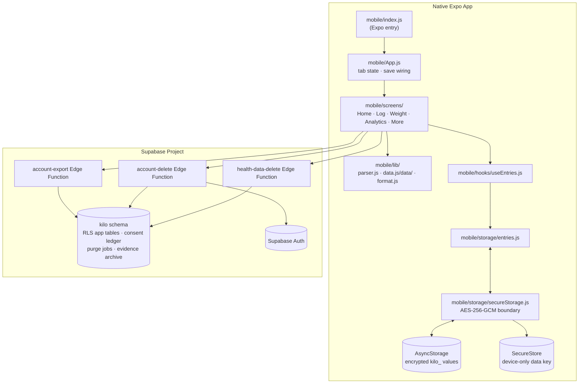

# Architecture

Status: current system contract. This document owns runtime boundaries, data
flow, persistence, sync, and derived-data ownership. Release status belongs in
`docs/current-state.md`; commands and coverage belong in
`docs/testing-and-qa.md`.

Kilo is a single-path native app:

- `mobile/` is the active Expo/React Native app and receives all forward-looking
  architecture work.
- The legacy browser prototype (`Kilo.html`, `src/`, `tests/`) is archived under
  `docs/archive/browser-prototype/`. The Capacitor Android shell and its test
  configuration are no longer active.

## Architecture Overview


```mermaid
graph TD
    subgraph expo["Native Expo App"]
        ExpoEntry["mobile/index.js\n(Expo entry)"]
        AppJs["mobile/App.js\ntab state · save wiring"]
        NativeScreens["mobile/screens/\nHome · Log · Weight · Analytics · More"]
        NativeLib["mobile/lib/\nparser.js · data.js/data/ · format.js"]
        NativeHooks["mobile/hooks/useEntries.js"]
        NativeStorage["mobile/storage/entries.js"]
        SecureStorage["mobile/storage/secureStorage.js\nAES-256-GCM boundary"]
        AS[("AsyncStorage\nencrypted kilo_ values")]
        DeviceKey[("SecureStore\ndevice-only data key")]
    end
    subgraph supabase["Supabase Project"]
        EdgeExport["account-export Edge Function"]
        EdgeDelete["account-delete Edge Function"]
        EdgeHealthDelete["health-data-delete Edge Function"]
        KiloSchema[("kilo schema\nRLS app tables · consent ledger\npurge jobs · evidence archive")]
        Auth[("Supabase Auth")]
    end

    ExpoEntry --> AppJs
    AppJs --> NativeScreens
    NativeScreens --> NativeLib
    NativeScreens --> NativeHooks
    NativeHooks --> NativeStorage
    NativeStorage <--> SecureStorage
    SecureStorage <--> AS
    SecureStorage --> DeviceKey
    NativeScreens --> EdgeExport
    NativeScreens --> EdgeDelete
    NativeScreens --> EdgeHealthDelete
    EdgeExport --> KiloSchema
    EdgeDelete --> KiloSchema
    EdgeHealthDelete --> KiloSchema
    EdgeDelete --> Auth
```

## Supabase Deployment Configuration

`supabase/config.toml` records the local project identifier, the exact exposed
schema set, and `verify_jwt = false` for `account-export` and
`account-delete`. `health-data-delete` also disables platform JWT verification
because it authenticates either the withdrawing user's JWT or the Vault-backed
service-role Cron worker itself. Those functions perform their own JWT
validation and must
receive CORS preflight and pre-auth rate-limit requests before authentication.
Their pre-auth IP buckets use the platform-controlled rightmost forwarding
value, while durable limiter hits live in `kilo.rate_limit_hits`. A scheduled
`pg_cron` reaper removes export hits after the 10-minute window and delete hits
after the 1-hour window so abandoned bucket keys cannot grow the table without
bound (#451).

The config's `project_id` is not the remote deployment target. Run
`scripts/deploy-kilo-functions.sh` from the repository root to deploy the three
Kilo-owned functions; the script supplies project ref
`ogzhnscdqcdrhfqcobuv` explicitly and does not deploy the unrelated `anime`
function hosted in the same Supabase project. It reports success only after the
Supabase management plane shows `account-export`, `account-delete`, and
`health-data-delete` as `ACTIVE` with an update timestamp from that deployment.

The production health-deletion worker also requires two **database Vault**
secrets, verified by name from `vault.secrets` (never decrypted, read, or
printed) by the deployment procedure:
`kilo_functions_base_url` and `kilo_service_role_key`. Set the base URL to the
production project URL. For this new-key project, set `kilo_service_role_key`
to its `sb_secret_` service-role value, not the legacy `service_role` JWT.
Before running the script, an authorized operator supplies `KILO_DATABASE_URL`
for its read-only `health-deletion-drain` cron check; do not put that URL or a
secret value in shell history or logs. To exercise the worker dispatch boundary,
the operator may additionally set `HEALTH_DELETION_FIXTURE_USER_ID` to a
disposable, already-due deletion job. The script dispatches only when that is
the sole due job, and otherwise fails without enqueuing or changing any user.

## Health-Deletion Queue Monitor

Deploy-time verification proves the purge worker's prerequisites existed once.
`.github/workflows/health-deletion-monitor.yml` proves they exist now. It runs
`scripts/check-health-deletion-backlog.mjs` every 30 minutes and on manual
dispatch, and reads the same prerequisites the deployment script checks: the
`health-deletion-drain` cron and the two Vault secret **names** returned by
`kilo.worker_secret_names()`.

The monitor exists because `kilo.dispatch_health_deletion_worker()` fails safe,
not loud: with the Edge Function or the Vault secrets absent it returns `NULL`
and only raises a warning, so `pg_cron` keeps succeeding while no row is ever
deleted and the withdrawing user sits in `deletion_pending` indefinitely.
Raising instead would abort the shared cron transaction and still delete
nothing, so operator visibility — not a louder database error — is the fix.

It alerts when any of these is true:

- an open deletion job is older than `KILO_DELETION_MAX_AGE_MINUTES` (default 60)
- a job has reached `KILO_DELETION_MAX_ATTEMPTS` (default 5) without completing
- a `running` job's CLAIM is older than `KILO_DELETION_RUNNING_STALE_MINUTES`
  (default 30), measured from `updated_at` -- the same clock
  `kilo.drain_health_deletion_jobs()` uses for its own stale-job reclaim, so the
  monitor and the reclaimer never disagree
- the `health-deletion-drain` cron is missing or inactive
- either required worker Vault secret name is absent

Exit codes are `0` healthy, `1` a real production problem, and `2` the check
could not run. Missing credentials or an unreachable database are exit 2 and a
**failed** monitor, never a green one; the `credentialless run exits 2, never
green` job asserts that property on every change to the monitor.

**Redaction.** `kilo.health_deletion_backlog(interval)` returns `user_id`. The
monitor drops it: alerts carry project, job id, reason, status, attempts, age,
and a bounded, scrubbed `last_error` only, built from an explicit allowlist so a
column added later is dropped by default rather than leaked by default. No user
ids, health values, email addresses, tokens, or secret values can reach an alert
surface. `npm run check:health-deletion:dry-run` renders the exact operator-
facing format against a synthetic snapshot without touching a database.

**How the monitor reads production.** Everything it needs comes from one
`security definer` accessor,
`kilo.health_deletion_monitor_snapshot()`, added by
`supabase/migrations/20260720120000_health_deletion_monitor_accessor.sql`. It
returns cron status, the required/present Vault secret NAMES, and per-job timing
metadata as a single JSON document.

That indirection is not stylistic; the monitor could not work without it. Two
row-level-security facts blocked the direct reads it used to do, both verified on
a disposable Postgres with every migration applied:

- `cron.job` enforces RLS as `username = CURRENT_USER`, and the
  `health-deletion-drain` entry is scheduled by `postgres`. A least-privilege
  monitor role therefore matched **zero** rows even holding `grant select on
  cron.job`, so the monitor reported `drain-cron-inactive` and exited 1 on every
  scheduled run. An operator cannot fix this either: `create policy ... on
  cron.job` fails with `must be owner of table job`.
- `kilo.health_data_deletion_jobs` has RLS enabled with **no policies**, i.e.
  deny-all without `BYPASSRLS`, so a column-level `grant select (id, status,
  updated_at)` still returned zero rows and `updated_at` was unreadable.

The accessor runs as its owner, so it sees both, while the monitor role keeps no
table access at all. It returns **no** `user_id`, no health values, and no secret
material -- the column list is an explicit allowlist, not `to_jsonb(j)`, so a
column added to the jobs table later is dropped by default rather than leaked by
default. `kilo.health_deletion_backlog(interval)` is unchanged and still returns
`user_id` for the service-role operator path; the monitor role cannot call it.

**Out-of-band configuration.** The migration creates the `kilo_deletion_monitor`
role and its single grant, so no manual grant step is required. Exactly one
action remains for an authorized operator, and it is never committed:

```sql
alter role kilo_deletion_monitor with password '<generated by the operator>';
```

Set that role's session-pooler URL as the `SUPABASE_HEALTH_MONITOR_URL`
repository secret. The role is read-only, holds `usage` on schema `kilo` and
`execute` on the accessor and nothing else, cannot read a table, cannot decrypt a
secret, cannot write, and reaches no co-tenant schema.

**Alert response.** Never clear, delete, or force-complete a job to silence the
alert: the user was told their erasure had started and is still waiting on it.

1. Inspect the backlog and the `net._http_response` metadata for the dispatched
   request to see whether the call left the database and what came back.
2. Restore the prerequisites: `health-data-delete` deployed and `ACTIVE`, both
   Vault secret names present, `health-deletion-drain` cron active.
3. Dispatch safely with `kilo.dispatch_health_deletion_worker()` once the
   prerequisites are back, or `kilo.reenqueue_health_deletion(user_id)` for a
   single wedged account. That re-enqueue is fail-closed: it acts only on an
   account whose consent state authorizes deletion (`deletion_pending` or
   `withdrawn`) and refuses a `granted`, `needs_reconsent`, or stateless account
   with an explicit reason, so it can never originate a purge against data the
   user still consents to keep.
4. Verify `kilo.health_data_row_counts(user_id)` is zero on every gated table.
   `kilo.complete_health_deletion_job` refuses to advance to `withdrawn` while
   any scoped row remains, so a `complete` job is itself the erasure proof.

## OTA Update Delivery

Preview and production builds receive compatible JavaScript and bundled-asset
updates through EAS Update (#811).

- `mobile/app.json` enables launch-time checks against the project update URL.
  The current Expo plan does not provide end-to-end code signing, so these
  updates are unsigned. Strong MFA on the Expo account is therefore part of the
  delivery boundary: account compromise could publish replacement JavaScript
  outside store review. Security-sensitive and native changes ship in native
  builds rather than OTA.
- `mobile/eas.json` isolates preview Android/iOS builds on the `preview` channel
  and production Android builds on `production`. Publish commands name both the
  channel and matching EAS environment explicitly.
- Preview uses the manual `preview-6` runtime. Production uses the app-version
  runtime policy. Native dependencies/configuration advance the applicable
  runtime and require replacement builds; OTA is only for runtime-compatible
  changes.
- The change from the disabled `preview-5` update client to `preview-6` is itself
  native configuration and requires one replacement preview build. Older
  `preview-5` clients remain isolated from new publications.

## Runtime Shape

The `mobile/` app is a separate runtime from the browser prototype. `mobile/index.js`
registers `mobile/App.js` with Expo. The current native architecture is narrow:

- `mobile/App.js` owns tab state plus the native save/reload orchestration
  layer, including the persisted fatigue-multiplier state threaded into More
  and Analytics and the shared auth/session hook threaded through More into
  Account so Account entry does not create a second session probe
- `mobile/lib/supabaseClient.js` is the single authorized Supabase client
  construction point in the app. Screens and hooks must not import
  `@supabase/supabase-js` directly; auth flows reach it through
  `mobile/hooks/useAuthSession.js`, and cloud storage reaches it through the
  storage adapter. The module stores native Supabase sessions in 2000-byte
  SecureStore chunks. Authoritative high-water metadata is raised before chunk
  writes and lowered only after cleanup, preventing new orphaned token chunks
  across shrinking writes, interrupted cleanup, and sign-out. Legacy or corrupt
  pre-HWM states receive a documented bounded 64-chunk best-effort sweep because
  SecureStore cannot enumerate unknown keys.
- `mobile/storage/secureStorage.js` is the native health/training persistence
  boundary. It encrypts every `kilo_` AsyncStorage value with AES-256-GCM and a
  device key held in SecureStore, authenticates each storage key as associated
  data, and serializes migration, read/write, and confirmed wipe operations.
  A successful wipe advances an app-shell generation that remounts every
  always-mounted tab, discarding hydrated domain state and unsaved health-data
  input before success is reported. If a post-sign-out or post-account-delete
  wipe fails, Account exposes a standalone signed-out retry that does not
  require the deleted/revoked cloud identity. Storage mutations capture a
  generation when queued, so an autosave waiting behind a wipe cannot recreate
  the discarded data afterward.
  Startup-wide plus lazy migration encrypt legacy plaintext before replacing it;
  a failed migration leaves the recoverable plaintext in place and fails closed.
  The startup-wide scan runs its full `getAllKeys()` + per-key pass at most once
  per device: a plaintext marker key records completion, and every later cold
  start reads that one marker instead of re-scanning every `kilo_` key, since
  the per-key lazy migration path already covers anything written before the
  scan last completed and no write after it can ever reintroduce plaintext
  (#809). `updateItem(key, transform)` rewrites one value as a single serialized
  read-transform-write, so no other storage operation can land between its
  read and its write (#813); a writer that read earlier and writes a whole
  value later is a separate matter, which is why every notebook and
  workout-notes-queue write path also strips the purged field itself.
  `getItem()` coalesces concurrent reads of the same key onto one in-flight
  read, so a value is decrypted once no matter how many mounted consumers ask
  for it at the same moment (#818). A pending read is shared only with callers
  that arrived before any operation that could change that key was enqueued:
  `setItem`/`removeItem`/`updateItem`/`multiSet`/`multiRemove` drop the pending
  entry for the keys they touch, and `clearDeviceKey`/`wipeKiloData` drop all
  of them, at enqueue time rather than at execution time. Because the operation
  queue is FIFO, a coalesced caller therefore always receives exactly the value
  its own read would have returned from the same queue position. The one-time
  plaintext migration deliberately does not invalidate: it re-encodes values
  that are already there and cannot change what any key decrypts to. Web
  retains browser storage semantics, where client-side key storage would not
  provide an independent security boundary.
- `mobile/components/` holds reusable shell and UI primitives
- `mobile/screens/MoreScreen.js` owns the More-tab routing shell. Help, About,
  Backup, Settings, and Profile sub-screens are extracted to individual files in
  `mobile/components/` (`HelpScreen.js`, `AboutScreen.js`, `BackupScreen.js`,
  `SettingsScreen.js`, `ProfileScreen.js`); `MoreScreen.js` imports and renders
  them. Account and AccountLifecycle remain in `mobile/screens/more/`. The
  screen routes to server-side account export and two-step deletion calls that
  stay behind Supabase Edge Functions rather than exposing privileged credentials
  to the client, leaving `HomeScreen.js` focused on dashboard rendering. The
  same public-account surfaces expose published privacy and terms links beside
  signup, near Account export/delete actions, and in More > About Kilo. The
  Account screen also starts GitHub OAuth on web and Android; Android uses
  `expo-web-browser` with `kilo://auth/callback`, then exchanges the returned
  PKCE code through the app-shell Supabase auth/session hook passed down from
  `App.js`. Password recovery reuses that callback boundary: the shared auth
  hook handles recovery sessions and native cold/warm deep links, while `App.js`
  and `MoreScreen.js` route active recovery state to the Account-owned
  set-new-password surface. While a recovery session or recovery-link error is
  active, the auto-sync ownership gate defers: it suppresses any upload/start-fresh
  prompt without clearing the owner marker and re-presents the still-valid decision
  once recovery completes or is exited, so recovery never sits behind the ownership
  overlay (#500).
- `mobile/hooks/useEntries.js` owns native read/write hooks for weight entries
  plus the persisted weight-goal and multi-note current-workout read/write
  paths, plus lightweight listener fanout for cross-consumer refreshes and a
  separate post-sync reload fanout that re-reads storage for every mounted
  workout-note and weight-entry hook instance, plus a shared reactive
  `useTrackedLifts()` hook consumed by both Log and Analytics. On mount,
  `useWeightEntries`/`useWorkoutNotes` read on-device storage immediately and
  do not wait on the initial cloud sync: `maybeSyncCloud()` still runs, but in
  the background, so first paint reflects the local cache rather than a
  network round trip (#809), and the follow-up read happens only when a pass
  actually ran (#813). Every later reload — a write, a broadcast, or an
  explicit `refresh()` call — keeps the ordinary sync-then-reload sequence,
  with concurrent callers sharing passes rather than each running one.
  All five tabs mount at once (#527), so several instances of these hooks
  hydrate from the same keys in one synchronous burst on cold start; each
  instance still owns its own read call, but the storage boundary's read
  coalescing above collapses them into one decrypt per key (#818). That also
  fixes their order: React runs child effects before the parent's, so the
  shell's own `useWeightEntries`/`useWorkoutNotes` reads — the two Home's
  `loading` prop is gated on — used to be enqueued behind every duplicate the
  four hidden tabs had already queued, and now land on the read a tab already
  started.
- `mobile/lib/parser.js` ports the canonical MVP parser path into native ES
  modules, now exposes the note-derived analytics contract used by downstream
  native workout analytics work, and centralizes exercise alias resolution in
  `normalizeExerciseKey()` so parser and data consumers share one canonical
  matching chain. `parseWorkoutNote()` also recognizes a standalone `---` line
  as the boundary between week A and week B inside one routine note and returns
  `weekBStartIndex` so Log can project the active week without splitting the
  stored routine into multiple notes
- `mobile/lib/data.js` is the compatibility barrel for shared data exports.
  Domain implementations live under `mobile/lib/data/`: exercise catalog and
  entry factories, weight goals, routine status, fatigue, skip data, workout
  analytics, 1K totals, and non-weighted metrics. The barrel preserves the
  existing consumer API, including the canonical `deriveWorkoutNoteAnalytics()`
  entry point and fatigue helpers `deriveSessionCheckIn()` and
  `deriveCheckInHistory()`. `parser.js` imports the exercise catalog directly
  from `data/exerciseCatalog.js` so the barrel does not create a parser/data
  dependency cycle
- `mobile/storage/entries.js` owns local reads/writes for recent-history
  data plus the local weight-goal key (`kilo_weight_goal`), the persisted
  fatigue-multiplier key (`kilo_fatigue_multiplier`), the global tracked-lift
  key (`kilo_tracked_lifts`), the optional user-profile key
  (`kilo_user_profile`), and the multi-note workout store
  (`kilo_workout_notes` and `kilo_current_workout_id`). Saved workout-note
  documents now also carry persisted `exercise_classifications`,
  `skip_markers`, `attendance_flags`, `session_checkins`, and `activeWeek`
  alongside
  tracked-lift and 1k-slot selections. The old `rep_drop_off_flags` surface is
  no longer produced or consumed by the active app path. The legacy session
  key remains only a migration source and the old single-note key remains both
  a migration source into the notebook model and a backup-compatibility
  fallback. Native reads and writes route through the encrypted storage boundary
  above; AsyncStorage remains its serialized backing store
- `mobile/screens/` holds one component per visible MVP surface
- `mobile/theme/colors.js` centralizes native design tokens
- `mobile/lib/format.js` contains a small shared timestamp formatter

The native path uses its own parser/data/storage modules.

## Screen Routing

`mobile/App.js` owns a separate `activeTab` state string initialized to
`'Home'`. All five native screens are mounted persistently and visibility is
toggled via `display: 'none'` / `display: 'flex'` based on `activeTab`,
eliminating remount flicker on tab switch:

```
activeTab: 'Home' | 'Log' | 'Weight' | 'Analytics' | 'More'
```

`mobile/components/TabBar.js` calls `setActiveTab` directly. The workout save
handler validates input, persists via the hook/storage layer, and then
navigates the user back to Home. The weight save handler validates and persists
but keeps the user on the Weight screen. The More tab now also owns a local
Settings & Algorithm sub-screen that updates a persisted fatigue-multiplier
value in `App.js` state and immediately re-derives Analytics through a
prop-driven recomputation path.

Cross-screen handoffs use a typed navigation-intent contract rather than ad hoc
per-destination arguments. A request is `{ tab, target, key }`: callers pass the
tab and an optional target to `handleTabPress`, and the shell mints the
monotonic `key` itself. The target vocabulary is
`{ kind: 'section', id: 'weight' | 'strength' }` for Analytics,
`{ kind: 'note', noteId }` for Log, and `{ kind: 'subview', view, anchor? }` for
More. One exported normalizer in `App.js` validates target *shape* and the
tab/kind pairing only; each destination's internal vocabulary stays with the
destination, so `MoreScreen` — not the shell — decides which sub-view names are
real. Malformed, unknown-kind, and wrong-tab targets normalize away and the tab
press proceeds unchanged. The shell keeps one independent (target, key) pair per
destination and advances a key only for an intent that addresses that
destination, so ordinary navigation never invalidates another tab's memoized
tree. An absent target preserves the destination's current internal state; a
later key re-applies an identical target; each destination consumes a key
exactly once. Log's note target is set-only: the shell says which note to show
and never reads or owns Log's editor state, so `LogScreen` itself decides the
current/loading/missing/editing outcomes and announces its refusals. Because
Log's Routine and Deload views are mutually exclusive and render disjoint sets
of notes off one shared viewer id, consuming a note intent also selects the view
that owns the resolved note. Absence counts as "deleted" only after a successful
read: while the note list is loading or a read has failed, the intent stays
pending so the existing Retry can still fulfill it.

Cloud sync status is a shell-owned subscription, not a per-tab one (#737).
Because all five tabs stay mounted, a screen-level `useCloudSyncStatus()` would
mean five permanent subscriptions and five duplicate dirty-queue scans on every
phase or queue broadcast. `App.js` calls the hook once and publishes
`{ summary, retrySync, openCloudSync }` through `CloudSyncContext`
(`mobile/hooks/useEntries.js`); screens read it with `useCloudSyncSummary()` and
never subscribe. Outside the provider the context is `null`, which consumers
treat as "no summary was published" and render no sync surface at all. The
summary derives at most one notice — `failed` or `pending`, with a running pass
suppressing both so a stale failure never outlives the retry it asks for — and
its copy describes the local queue only; Kilo does no connectivity detection, so
nothing in it claims a connection or an in-flight request. `openCloudSync` is an
ordinary typed intent (`CLOUD_SYNC_NAV_TARGET`, exported from `App.js`) rather
than a bespoke route, so a repeated request re-applies under a later key like
any other, and `retrySync` binds the same `useSyncRecovery` runner the Cloud
Sync panel's own Retry uses — no second sync path exists.

Loading, failure, and verified-empty are distinct outcomes on every mounted
surface (#737). Home, Log, and Weight paint static (non-animated) placeholder
cards while a first read is unresolved, and Home, Log, Weight, and Analytics
surface a retry banner when a read fails. This matters because the entry hooks
clear `loading` on failure and leave their collection empty, making a failed
read byte-identical to a genuinely empty account: every screen therefore
requires a *successful* read before it may render onboarding/empty copy or a
zeroed dashboard, and withholds derived sections it cannot honestly compute.
A failed read that still has cached data keeps rendering it under the banner.

Failure state is per read source, not per screen: Weight raises one banner for
the weigh-in read and one for the goal read, each retrying only its own source,
and Home folds its two locally-owned reads (`useWeightGoal`, `useTrackedLifts`)
in with the shell's weight/note reads behind one retry that re-runs all of them.
`useWeightGoal` was the last read hook without an `error`/`refresh` pair; it now
matches `useWeightEntries` and `useTrackedLifts`, and a failed refresh keeps the
previously loaded value rather than reverting to null. Writes never clear
`error` themselves — `notifyGoal()` re-runs the read, and that read decides.

Across every read hook in `hooks/entries`, `error` is cleared **only by a read
that succeeds**, never on the way into one. Clearing it eagerly reopened the
exact hole these states close: after a first failure the hook already sits at
`loading: false` with an empty collection, so dropping `error` at the start of a
retry left `{ empty, not loading, no error }` — a verified-empty signature — for
the whole duration of the retry read, and the screen fell back to its
onboarding/no-data rendering mid-recovery. The last completed read stays the
truth until a new one replaces it, so a retry holds the failure until it
resolves and a retry that fails again does not flicker.

That contract reaches the storage layer through a second, additive reader.
`loadWeightGoal()` in `storage/entries/weightGoal.js` catches its own errors and
resolves `null`, which collapses "unreadable record" into "no goal set" — and it
has to keep doing so, because `syncAdapter` (`buildWeightGoalRecords`,
`applyWeightGoal`), `bootstrap`, `exportBackup`, and `localAdapter` all await it
and are not written to survive a rejection; making it throw would let a corrupt
goal record fail a sync pass or an export. So the honest signal is a separate
`loadWeightGoalResult()` returning `{ ok, goal, error }`, which never rejects
either: `ok: false` is a failed read and `ok: true` with `goal: null` is a
verified absence. `useWeightGoal` reads through it; every sync/bootstrap/export
caller keeps the unchanged `loadWeightGoal()`. New UI reads that must tell
failure from absence should use the result variant.

For nested navigation, `App.js` exposes one
active-tab back-consumer slot; `MoreScreen` registers its menu-pop handler only
while an active child is visible. The shell consults that consumer before its
Android Home/exit fallback, and the same child-ownership signal suppresses the
global web Home control in a pre-paint layout effect. `App.js` also provides shared scroll
activity down through `ScreenShell` so the tab bar can react to content
scrolling as an overlay surface. There is no router library or persisted
navigation state in the native path. The only registered deep link is
`kilo://auth/callback`: active Android GitHub OAuth consumes it through the
browser auth session, while password-recovery links opened externally are
handled by the shared auth hook and route the shell to More > Account.

`mobile/screens/WeightScreen.js` also renders saved weight history as a direct
correction surface. Tapping a row reloads that entry into the shared form
state, edit submissions rerun `parseWeightEntry()` before
`updateWeightEntry()`, delete submissions remove the selected entry in place,
and the hook-level listener fanout reloads other weight consumers so Home,
Analytics, and the Weight history stay in sync after edits or deletes. The same
screen also saves an optional weight-goal record (target weight + target date),
derives direction and required weekly pace from a centralized current-weight
resolution contract in `mobile/lib/data.js` (latest saved entry by date when
present, otherwise the saved goal `start_weight`, or the in-progress typed
fallback while editing), renders advisory warnings without blocking the
save path, detects when the active goal has been met, and lets the user archive
the completed goal so current analytics clear back to the new-goal path while
the completed target/start/completion fields are preserved as history. Shared
prior-window comparison ownership for weight trends also now
lives in `computeWeightTrendSummary()` in `mobile/lib/data.js`, and Weight,
Home, and Analytics now all consume that shared weight/goal derivation contract
through `deriveWeightGoalAnalytics()` instead of carrying screen-local
reshaping.

Tracked-lift visibility now follows a similar shared-hook pattern. Log toggles
persist through the global `kilo_tracked_lifts` map, `useTrackedLifts()`
fanouts the updated in-memory state to all mounted consumers immediately, and
Analytics filters that global tracked set down to lifts present in the current
routine while still deriving each visible lift's trend and exercise display
casing from all routine notes through `deriveWorkoutNoteAnalytics()`. Because
that tracked-lift map is global, PO/tracked progression continuity survives
current-routine switches without any per-routine migration step; only 1K slot
selections are rolled from one routine note to another when the user accepts
the switch prompt.

## Parse-to-Persistence Flow

```
User types in native Weight or Log form
  → App.js save handler calls native parser (`parseWeightEntry`) or workout-note save path
  → on error: save is blocked in the handler
  → on ok: App.js builds a canonical weight entry via `makeWeightEntry`, or parses the workout note, derives persisted session classifications plus skip/attendance metadata, and upserts the selected titled workout note through `useWorkoutNotes`
  → `useWeightEntries` / `useWorkoutNotes` writes through `mobile/storage/entries.js`
  → AsyncStorage persists the updated weight list, workout-notes array, and current-workout id
  → hook state updates
  → Home / Analytics re-derive recent activity and analytics from the selected current workout note
```

`mobile/storage/entries.js` also exposes a backup/restore recovery path:
`exportBackup()` serializes a versioned v4 snapshot (weight entries, titled
workout notes with `isCurrent` / `currentSince` metadata, the current workout
id, an optional weight goal, an optional fatigue multiplier, the completed
deload history, and — since issue #694 — the two recovery collections:
`recovery_blocks` with each frozen `baseline` snapshot, and
`recovery_block_weeks`). Both recovery collections are emitted through explicit
field allowlists and carry their retained tombstones, because a tombstone is the
only record that a block or membership was removed.
`importBackup(payload, 'replace')` validates before any write, restores the
full multi-note model for v2 and later backups, conditionally restores or clears the
weight goal when the key is present, restores only a finite in-range fatigue
multiplier, validates every v3/v4 deload-history record and caps its raw text before
restoring it, and still
accepts v1 backups to restore weight history without
clearing the newer workout-note state.

Recovery data is restored only from a v4 backup, and blocks are always restored
before memberships — the order the real
`recovery_block_weeks (user_id, block_id)` foreign key requires. A v4 payload
carries both collections or neither: half a payload is unrestorable in either
direction, since memberships alone have references that cannot be checked, and
blocks alone would tombstone a block by omission while the device's live
memberships still point at it.

Validation is bounded and total before the first write. Per record: non-empty
unique ids, every membership's `block_id` resolving to a block in the same
payload, a required positive-integer week ordinal, strict ISO instants, and a
frozen baseline that is an object with a known snapshot version and a bounded,
numerically typed exercise list.

Two of those are stricter than the cloud column they mirror, deliberately. The
`week_number` column is nullable, but the local domain has no such tolerance —
`orderedLiveWeeks` subtracts ordinals numerically and `nextWeekNumber` derives
from the highest one, so a null stops week order from being a total order rather
than leaving a harmless gap. Timestamps are matched against a strict ISO instant
pattern with calendar validation instead of `Date.parse`, which accepts `"1"`,
`"2026"`, and `"March 5, 2026"`, and which normalizes an impossible calendar date
rather than rejecting it — `"2026-02-30T00:00:00Z"` parses to March 2 while the
importer persists the original string. An explicit UTC offset is required, since
both producers of these values emit one (`toISOString()` on the device,
PostgREST's `+00:00` with up to microsecond precision for a server-stamped
`updated_at`) and a local-time string names no instant to order against. Across the collections, the same three
cross-record invariants the cloud tables enforce as partial unique indexes over
live rows — one active block, one live membership per workout note, unique live
week ordinals within a block. Those three are checked here because the database
otherwise catches them only mid-push, after a replace has already overwritten
local storage and enqueued the rows; in local mode nothing pushes at all, so an
invalid domain state would simply persist. Like the indexes, all three are
scoped to live rows, so a completed block, a tombstoned membership, and a reused
week ordinal are history rather than conflicts. A malformed recovery collection
therefore rejects the whole restore, so no partial state reaches storage or the
sync queue. A v1/v2/v3 file predates the
format and says nothing about recovery data, so a legacy restore leaves every
block and membership exactly where it is rather than treating silence as a
deletion.

The same storage module also performs a
one-time forward migration from the legacy single-note key by seeding a
`Routine 1` notebook entry with `isCurrent: true` and `currentSince: null`,
and normalizes pre-existing notebook rows that predate the new metadata fields.

Import has two contracts and the caller states which one applies, because a
device with no account and a device that is one replica of an account need
different behavior from the same button. `importBackup(payload, 'replace',
{ mode })` takes the local contract by default: it overwrites the domain keys and
nothing else, which is the whole story when the device is the only copy. The app
shell passes the active storage mode through, so a signed-in user gets the cloud
contract instead. Before #526 there was only the local path and it ran in cloud
mode too, so a cloud restore wrote local keys, enqueued nothing, tombstoned
nothing, reported success, and left the account holding the pre-import data until
the next pull put it back (#522 claim 5).

Under the cloud contract a replace is a batch of ordinary cloud writes rather
than a special upload path. Every imported collection row is stamped and enqueued
with the same primitives an in-app edit uses, and every `weight_entries`,
`workout_notes`, `recovery_blocks`, or `recovery_block_weeks` record the backup
OMITS becomes a tombstone, because "replace" means those records are gone and a
plain local deletion would simply be re-pulled from the server. Local storage is written before the queue, so an interruption
between them leaves the imported state on disk for the signed-out-write
reconciliation above to re-derive; the reverse order would promise rows the
device does not have. The importer never uploads anything itself, so
last-write-wins, tombstone ordering, cursor advancement, and the consent gate at
the sync seam are all unchanged, and a failed push retries with both the imported
state and the deletion intent intact. Incoming `updated_at` and `client_id` are
dropped rather than trusted, since they describe the exporting device's history
and would otherwise compete in LWW as if this device had made the write;
`deleted_at` is preserved, because a backup taken from raw storage legitimately
carries tombstones.

Everything outside those four collections is left to the diff-tracked sync path
and needs no import-time queueing: the weight goal, deload history, profile,
health profile, and feature toggles detect local change by diffing live state
against a persisted snapshot, and that diff is indifferent to which writer
produced the change. `archived_weight_goals` is a collection table the backup
format does not carry at all, so a replace leaves it untouched — the payload is
not evidence that those records were dropped, and tombstoning them on that
non-evidence would destroy data the user never asked to remove. A v1 backup
predates the notebook model and likewise does not delete workout notes.

## Launch Abuse Boundary

Supabase Auth owns platform authentication throttles and CAPTCHA enforcement for
signup, password recovery, verification, and token endpoints. Kilo's launch
configuration keeps those platform limits active, uses production-owned SMTP for
public email signup and password recovery, and enables CAPTCHA before open
signup. The client renders Cloudflare Turnstile for sign-in, signup, and password
reset, consumes each token once, and fails closed in release builds when the
public site key (and the native HTTPS base origin) is missing. The Turnstile
secret remains only in Supabase Auth configuration.
The production SMTP boundary is Resend with a verified sender domain (#478);
delivery authentication is configured outside the repository in Supabase Auth.

Kilo-owned Edge Functions remain responsible for app-specific abuse controls.
`account-export` and `account-delete` require the caller JWT, perform no
unauthenticated writes, keep service-role credentials server-side only, and
apply durable, shared per-user and per-IP rate limits. Their shared CORS helper
defaults closed with no browser origins allowlisted; native callers are
unaffected, and any future browser caller must be added explicitly rather than
receiving a wildcard origin. Limit state lives in
Postgres (`kilo.rate_limit_hits` via the `kilo.rate_limit_check` SECURITY
DEFINER function, granted to `service_role` only), so the limits hold across
Edge-Function isolate recycling and cold starts rather than resetting per
isolate; a per-bucket advisory lock makes each check-and-record atomic under
concurrency. `account-export` limits successful exports to one per signed-in
user per 10 minutes by default, while `account-delete` limits delete attempts to
three per signed-in user per hour by default; both functions also reject
repeated callers through an IP bucket. Every current sensitive endpoint chooses
the explicit fail-closed limiter policy, returning the same throttle response if
the durable check is unavailable. Limiter error logs retain only a bounded error
code and never the raw IP/user bucket or upstream message.

Authenticated direct writes remain owner-isolated by RLS and are additionally
bounded by private `account_storage_usage` and `collection_storage_usage`
ledgers. Fixed-search-path triggers enforce field/row limits plus atomic
per-collection and aggregate account quotas; authenticated clients have no
access to the ledgers, and concurrent writes serialize on the account row rather
than racing a count query.

## Session Check-In (Fatigue) Flow

The fatigue feature is a detection → response → consumer pipeline keyed by
session index on the current workout note. The old rep-drop-off / `hit_wall`
chip is gone; nothing in the active path produces or reads `rep_drop_off_flags`.

- **Detection** — `deriveSessionCheckIn(sections, trackedNames)` in
  `mobile/lib/data.js` evaluates the latest (deepest) session column of the
  current note only. It runs skip, whole-day-skip, and per-exercise
  volume-drop/collapse detectors over the tracked lifts and returns
  `{ sessionIndex, isRough, detectors, flagged, metrics }`. `LogScreen.js` runs
  this when the user leaves the current-routine editor after a rough session.
- **Prompt** — when `isRough` is true and no matching
  `session_checkins[sessionIndex]` entry exists yet, `LogScreen.js` highlights
  the flagged exercises in red in the rendered note and opens
  `mobile/components/SessionCheckInModal.js` with a detector-aware title and the
  flagged exercise names.
- **Response / persistence** — the modal writes a check-in record onto the
  note's `session_checkins[sessionIndex]` carrying `status`
  (`'ok'` / `'rough'` / `null` for a dismissed/pending answer), optional
  `reasons` and free-text `note`, the captured detector `metrics`
  (`exercises_skipped`, `volume_decline_pct`), `flagged`, `detectors`, and an
  answer-time `responded_at` ISO timestamp. The highlight and prompt suppress
  once that entry exists. This record is persisted on the workout-note document
  through the normal note save path.
- **Consumer** — `deriveCheckInHistory(notes)` in `mobile/lib/data.js` flattens
  `session_checkins` across all notes into a `responded_at`-sorted history split
  into `rough` / `ok` / `pending` groups plus a summary (`top_reason`, group
  totals). `AnalyticsScreen.js` consumes this for the `Fatigue` section and can
  reopen `SessionCheckInModal` against an existing record to edit it, preserving
  the original `responded_at`. Both the Log prompt and the Analytics Fatigue
  surface are gated on the More > Settings `Fatigue tracking` toggle.

## Persistence Model

### AsyncStorage keys

| Key | Contents |
|-----|----------|
| `kilo_local_data_owner` | Single bootstrap/sync ownership gate: `unclaimed`, `unknown`, or the owning Supabase user id. Foreign-owned history requires an explicit purge-or-upload choice before cloud mode starts. |
| `kilo_weight_entries` | JSON array of native weight entries |
| `kilo_weight_goal` | Optional native weight-goal object |
| `kilo_archived_weight_goals` | JSON array of archived completed weight-goal records, including target/start/completed weights plus archive/sync metadata |
| `kilo_fatigue_multiplier` | Persisted native fatigue-multiplier number |
| `kilo_weigh_in_reminder` | Optional local daily weigh-in reminder settings (`enabled`, `hour`, `minute`) |
| `kilo_workout_reminder` | Optional local workout-day nudge settings (`enabled`, `hour`, `minute`, `fallbackWeekdays`) |
| `kilo_tracked_lifts` | JSON object keyed by normalized lift name for global Track toggles |
| `kilo_user_profile` | Optional native calorie-profile object with `height_cm`, `date_of_birth`, `sex`, `activity_level`, and `saved_at` |
| `kilo_workout_sessions` | Legacy JSON array of native structured workout sessions, retained only as a migration source |
| `kilo_workout_notes` | JSON array of titled native workout note documents, including persisted `tracked_exercises`, `one_k_exercises`, `exercise_classifications`, `skip_markers`, `attendance_flags`, and `session_checkins` fields; legacy entries may still carry stale `rep_drop_off_flags`. Never carries parser output: a `derived_sections` field is stripped on every write and purged once from older notebooks (#813) |
| `kilo_derived_sections_purge_v1_complete` | Marker that the one-time `derived_sections` purge (#813) has completed on this device; every later launch reads only this key. Bookkeeping, no user data |
| `kilo_current_workout_id` | String id of the selected current native workout note |
| `kilo_workout_deload_history` | JSON array of completed deload records (`id`, `raw_text`, `generated_at`, `completed_at`, `session_count`, optional `deload_session_ordinal`); `completed_at` drives calendar/display behavior while Analytics session counts use the furthest stored session anchor (`deload_session_ordinal` for new records, `session_count` for legacy records) |
| `kilo_workout_deload_note` | Active in-progress deload note document; cleared on deload completion or discard |
| `kilo_workout_note` | Legacy single-note key retained for backup compatibility |
| `kilo_fatigue_tracking_enabled` | Persisted feature toggle for fatigue / session check-in tracking (More > Settings) |
| `kilo_deload_mode_enabled` | Persisted feature toggle enabling deload flow in Log (More > Settings) |
| `kilo_weight_date_edit_enabled` | Developer / advanced setting enabling manual date editing on weight entries |
| `kilo_deload_date_edit_enabled` | Developer / advanced setting enabling manual date editing on deload entries |
| `kilo_log_current_collapsed` | Persisted UI state: whether the current Log routine card is collapsed |
| `kilo_recovery_blocks` | JSON array of recovery-block records (`baseline_note_id`, the frozen versioned `baseline` snapshot, `include_in_normal_analytics`, the optional free-text `reason` a block was started, `started_at`, `completed_at`) plus sync metadata and retained tombstones. `reason` is `null` when none was given, including on every record written before it existed; nothing in the domain reads it, so it changes no membership, baseline, comparison, or analytics result |
| `kilo_recovery_block_weeks` | JSON array of ordered recovery-week memberships linking a workout note to a block (`block_id`, `note_id`, domain-assigned `week_number`, `completed_at`) plus sync metadata and retained tombstones |
| `kilo_recovery_operation_journal_v1` | Device-local write-ahead journal of in-flight multi-record recovery lifecycle operations (`operation_id`, schema `version`, `type`, affected `block_id`/`week_id`/`note_id`, immutable requested timestamp, intended outcome, stage/attempt metadata, `created_at`/`updated_at`, last-error diagnostics). Protocol metadata, not user health data: never exported in a backup, never a sync table, and never stores workout-note text |

### Recovery lifecycle operation journal

Three Log-tab recovery actions change more than one persisted collection:
completing a recovery block together with its open current week; deleting a
workout note that is a linked recovery week (membership plus the note, which in
cloud mode is a tombstone plus sync-queue intent); and creating a brand-new note
AND attaching it as the next sequential week (notebook plus membership). AsyncStorage, the workout-note cloud queue,
`kilo_recovery_blocks`, and `kilo_recovery_block_weeks` share no native
transaction, and snapshot-and-revert cannot substitute for one: the revert write
can itself fail, and a note-delete that persists the removal and then throws is
indistinguishable from one that never committed.

`mobile/storage/entries/recoveryOperationJournal.js` owns the protocol.
Ownership and ordering, per operation:

1. validate eligibility against persisted state — a rejection here writes nothing,
   journal included;
2. persist the operation intent under `kilo_recovery_operation_journal_v1` before
   the first domain write. If that write fails, no domain mutation happens;
3. apply idempotent domain writes toward the recorded outcome, in a fixed order,
   each conditional on its own postcondition being unmet, all reusing the one
   immutable requested timestamp on the record;
4. re-read every affected collection from persisted storage;
5. verify all postconditions;
6. clear the journal record only after verification succeeds. A failed clear is
   reported as a verified success whose cleanup is retried, never as a failure and
   never as a silently dropped record;
7. notify/refresh UI only after a verified result or a durable pending state.

All three operations roll forward only. A note deletion converges to "membership
tombstoned and note deleted/tombstoned with pending-sync intent", never back to a
live membership, because restoring one could point a live week at a note that is
already gone. Block completion converges to block and current week completed at
one stable timestamp, and never reopens a record or slides a timestamp forward.
The new-note week converges to "this note is durably LIVE and this week id links
it at this ordinal": both the note id and the ordinal are minted once at intent
time and stored on the record as seeds, so no replay can mint a second note or a
second ordinal, and a same-tick double confirm cannot allocate two. The note
postcondition is deliberately not existence — a tombstoned row exists, and in
cloud mode `saveWorkoutNoteItem` persists the row before it enqueues, so a failed
enqueue leaves a note that exists with no durable upload intent. Since memberships
reach the cloud through the baseline diff, verifying on existence alone would
publish a membership referencing a note that may never upload. The postcondition is
therefore `exists && !deleted`, plus queued intent in cloud mode
(`loadWorkoutNotePresenceState`), repaired idempotently from the recorded seed by
`ensureWorkoutNoteLive`.

Retention is only honest when a retry can change the result, so conditions no
retry, restart, or sync can alter get an explicit terminal transition instead of
permanent pending:

- **ordinal claimed by another device** — a durable reassignment. The next free
  ordinal (one past the highest live week, the domain's own rule) is written onto
  the journal record *before* any domain write, so replay and verification both
  read the reassigned value and the outcome stays single and recorded. One retry
  exits the conflict.
- **the seeded note has joined another block**, or **the target block was
  deleted** — `CONFLICT_CANCELLED`. The record is retired, so nothing stays
  locked, and the caller receives a terminal non-ok result describing what
  happened. Anything already persisted remains an ordinary workout note:
  destroying a note the user asked to create, over a race they did not cause, is
  worse than the untidiness. If the retiring write itself fails, the result
  degrades to ordinary pending rather than claiming resolution.

Reconciliation reports `pending` and `cancelled` separately for exactly this
reason: pending locks conflicting actions, cancelled locks nothing and is shown
once, without a retry affordance there is nothing left to retry.
An unreadable, malformed, or unsupported-version journal fails closed with a
retryable error; it is never read as "no pending work". A verification read that
cannot determine the outcome retains the record rather than choosing a default.

The journal owns no notebook mechanics of its own. The mode-aware implementations
(local hard-delete, or cloud tombstone plus `enqueueDirty` bookkeeping) are
registered into it at load by `mobile/hooks/entries/storageMode.js`, so replay
always uses the adapter current when it runs and repairing local invariants never
requires network access or a signed-in session. The local default is what a
signed-out device uses.

Because the storage mode can change while an operation is pending, cloud-mode
deletion verification never accepts local absence as proof. A local-mode attempt
hard-removes the note; if it is interrupted before verification and the device then
enters cloud mode, the row may still be live on the server and would return on the
next pull. `loadWorkoutNoteDeletionState` in `storage/cloud/cloudDomainMethods.js`
therefore reports `requiresQueue: true` even for an absent note, and
`ensureWorkoutNoteDeleted` reconstructs a minimal tombstone from the journal's own
recorded id and requested timestamp, persists it, and enqueues it. Only durable
pending-sync intent can verify a cloud-mode deletion. A deletion that local mode
already verified and cleared is a different case, handled by the existing
`reconcileSignedOutWrites` baseline diff rather than by this journal.

One reconciler serves every entry point — `reconcileRecoveryOperations()`. It runs
on initial mount/remount before recovery lifecycle state is considered ready,
before any conflicting lifecycle action (a still-pending operation over the same
block, week, or note blocks the action instead of writing underneath it), behind
the UI's `Retry recovery` affordance, and on both cloud sync boundaries: before a
pass reads or pushes workout notes, recovery blocks, or recovery weeks, and again
after the pull/merge before the SYNC phase may be published as complete, because a
remote change can alter an affected record while an operation is pending
(`withRecoveryReconciliation` in `storageMode.js`, applied by both `maybeSyncCloud`
and every `SYNC_PHASE.SYNC` runner in `syncRecoveryHooks.js`). An operation that
still cannot be verified fails the pass, surfacing through the existing
failed/retryable sync state with the reconciliation cause rather than a silent
"Fully synced".

UI actions, retries, sync, and cloud bootstrap share one single-flight queue, and
that boundary holds it across the WHOLE pre-reconcile → operation →
post-reconcile sequence (`withExclusiveRecoveryAccess`), not merely around each
reconciliation. Releasing
it for the pass body would not be safe: the sync engine and the journal replayers
both read a complete `recovery_blocks`/`recovery_block_weeks` array and later write
the whole array back, so a lifecycle action executing during the pass means
whichever side writes last silently discards the other's change — and the post-pass
reconciliation cannot detect that once the UI operation has verified and cleared
its own record, so sync would report success over a lost update. Excluding
lifecycle writes for the duration of the pass is what actually prevents it. The
nested pre/post reconciliation runs without re-acquiring the guard, which is what
keeps that nesting from deadlocking; competing UI actions queue behind the pass and
run against post-pass state.

Cloud **bootstrap** gets the identical boundary, applied at `makeBootstrapRunner`
in `syncRecoveryHooks.js` so both upload paths (`runBootstrap` and
`confirmOwnershipUpload`) are covered by one seam. `buildBootstrapPlan` includes
`recovery_blocks` and `recovery_block_weeks`, so bootstrap reads and uploads
exactly the collections the journal rewrites — and it matters more there than for
an ordinary pass, because there is no earlier cloud state to converge against:
whatever bootstrap uploads becomes the account's initial truth. An operation still
pending at sign-in would otherwise be uploaded as a partial transition, and a
lifecycle action started while the snapshot is being built or uploaded would race a
whole-list write. Because both callers persist ownership and switch the storage
mode only after the runner resolves, the post-reconcile always completes first; a
pending or corrupt journal throws, which `runPhase` turns into a failed/retryable
BOOTSTRAP phase with the owner unwritten, the mode still local, and the journal
intact. The pull-only restore path (`downloadAccountData`) needs no boundary of its
own: it uploads nothing, runs only on a verified-empty device, and its follow-on
sync already goes through the same guard.

### Cloud sync pass cost

A sync pass is bounded by two things, and both are shaped deliberately (#806).

**Device storage.** Every synced table lives in one encrypted `kilo_` value, so
touching a table at all costs a full decrypt + parse (or stringify + encrypt) of
every row it holds. Three rules keep that from scaling with the account rather
than with the pending work:

- The dirty queue is written **once per batch**, never once per record.
  `enqueueDirtyMany` is the bulk entry point used by the signed-out
  reconciliation, the diff-table pass, and the #538 rebuild reseed;
  `enqueueDirty` is a single-record call through it. Enqueueing row by row is
  quadratic in the batch, because each record rewrote the whole queue.
- `runSyncPass` holds a **pass-scoped table cache** (`createPassCache` in
  `storage/cloud/syncAdapter.js`). Each collection table is read once per pass
  and shared by the reconciliation, the phantom-note cleanup, the merge, and the
  derived fatigue projection. A write whose serialized form matches what the
  pass already holds is skipped outright, so a pass that changes nothing writes
  nothing.
- A write that DOES change the table re-reads it first and folds in any row the
  domain changed since the pass took its copy (`preserveConcurrentWrites`). The
  cloud-operation queue does not serialize UI/domain writes, so a
  `saveWeightEntry` can land between the copy and the write; without the reload
  the whole-table replace would drop it from the device until a later pass
  rebuilt it from the dirty queue — and if that pass fails before its push, it
  would not rebuild it at all. Concurrent rows win because a cloud-mode domain
  write is stamped and dirty-queued, which is the same "pending local row is not
  voted against remote" rule `syncTable` already applies. The reload happens only
  on a write that will touch storage, so the steady-state pass pays nothing.
- `syncTable` records its baseline from the list `writeLocal` **returned**, not
  from a re-read. Every table writer returns what it actually persisted, which
  is both cheaper and stricter: a re-read could sweep a concurrent domain write
  into the baseline and launder it into looking synced.
- `setSyncSnapshot` skips a byte-identical baseline rewrite, and may only do so
  against a value `getSyncSnapshot` has actually read back — one read grounds
  one skip, so a snapshot removed outside `clearSyncSnapshot` (a device wipe, a
  purge) costs at most one skipped write before the next read repairs it.

**Round trips.** Tables that do not depend on each other pull and push together:
`weight_entries`, `workout_notes`, and `archived_weight_goals` as one group, then
all six diff-tracked tables as another. The orders that carry meaning are
unchanged and still strictly sequential — workout notes before `recovery_blocks`
(a block names the note its frozen baseline came from), `recovery_blocks` before
`recovery_block_weeks`, and every collection table before the diff-tracked ones
(so `fatigue_checkins` projects a settled notebook and `user_health_profile`
uploads a `current_workout_note_id` the pass is not about to drop). Groups are
settled with `Promise.allSettled` and the first failure is raised only after every
member has finished, so a pass never reports a failure while its own work is still
in flight.

A failing pass drains its deferred rows before the failure propagates. Phantom-note
tombstones and collapsed recovery duplicates are held in memory until the pass
enqueues them, but the table that produced them has already recorded a baseline
containing them — so the next pass's reconciliation finds no local difference and
would never rediscover them. Draining into the durable dirty queue on the way out
is what stops a tombstone this device minted from being silently dropped while the
phantom lives on in the cloud.

`transport.push` also caches the user id it validated against the exact
access token it validated, so one pass costs one `auth.getUser()` round trip
rather than one per pushed table; RLS remains the authority that rejects a
mismatched `user_id`.

**Payload size.** Because every table is one encrypted value, what a pass costs
is set by what a row carries, and on a device every byte is decrypted and
re-encrypted in pure JS on the UI thread. The notebook therefore never persists
derived parser output (#813): the merge's recompute seam
(`storage/cloud/transport.js`, consumed by `syncQueue.resolveRecord` when local
and remote agree on `raw_text`) has no default recompute, every notebook read
and write path strips a `derived_sections` field
(`storage/entries/derivedCache.js`), every read and write of the workout-notes
dirty queue normalizes the whole queue the same way (so a writer holding a
stale copy cannot restore it), backup export/import do the same, and the
sync fingerprint ignores it so a note that differs from its baseline only by
that cache is never treated as a local edit. Older builds attached the parser's
full output - roughly a hundred times the note text - to every note a device
had ever pushed, because `pull_sync_changes` serves a device its own pushed rows
on the next pull; `purgePersistedDerivedSections()` strips it once per device
at startup, one key at a time, each as a single serialized rewrite
(`secureStorage.updateItem`).

**Fan-out.** A write broadcast reaches every mounted `useWorkoutNotes()` /
`useWeightEntries()` instance, and each instance's `refresh()` asks for a sync.
`maybeSyncCloud()` (`hooks/entries/storageMode.js`) shares passes between those
callers (#813): callers arriving before a pass starts join it, callers arriving
while one runs are promised exactly one trailing pass, and every caller still
gets a pass that began after its own (already durable) write. `sync()`'s
single-flight alone could not do this, because the recovery-reconciliation
guard around it is a strict queue.

**Phase run ownership.** A sync pass can outlive the phase it started, so
`storage/syncRecovery.js` gives every run an ownership token (`beginPhaseRun`);
`markComplete`/`markFailed` publish nothing when the token they are handed is no
longer the current one, and every transition - a run starting, a settle, a
`resetPhase` - claims a fresh token. Status alone is not enough to identify a
run: sign-out resets the SYNC phase mid-flight (a late completion there would
leave a signed-out device non-idle and skip the next sign-in's automatic sync),
and after a re-sign-in the new pass has set the phase running again, which looks
identical to the stale pass's own `running`. Without the token the stale pass
would settle the live one and stamp a last-successful-sync time for a pass that
had not finished. `runCloudSyncPass` additionally requires cloud mode, and
`runPhase` carries its own token the same way.

### Authoritative Recovery read state

`hooks/entries/recoveryBlockHooks.js` owns one shared, module-scoped Recovery
snapshot plus the lifecycle status around it. `useRecoveryBlockState` is a
subscriber to that store, not an owner of its own copy, so the Log and Analytics
tabs cannot hold divergent snapshots while mounted together, and
`useRecoveryAnalyticsFilter` publishes into and reads from the same snapshot.
Every read goes through `refreshRecoveryState()`, which runs at most one
reconcile-then-read at a time and coalesces concurrent requests into a single
queued follow-up, so two mounted consumers can never reconcile the journal
concurrently.

The store distinguishes `idle`, `loading`, `ready`, `refreshing`, `stale`, and
`error` (`RECOVERY_STATUS`). The load-bearing distinction is `ready`: it is true
only after a read has actually succeeded, so an empty `blocks`/`weeks` array is a
verified result only when `ready` is true and a placeholder otherwise. A failed
read is never promoted to a result — a refresh failure over a verified snapshot
keeps last-known-good blocks and weeks visible and marks them `stale` with a
retry path, and a first-load failure produces `error`, not an empty state.

Recovery eligibility and every recovery mutation stay closed until the snapshot
is verified. `LogScreen` derives no eligible baseline or week notes while
`ready` is false (both predicates mean "no live membership blocks this note", so
an unverified empty snapshot would call every note eligible), and every mutation
in `useRecoveryBlockLifecycle`/`useStartRecoveryBlock` calls
`ensureVerifiedRecoveryState()` at confirmation time — re-establishing a verified
read then, not trusting the render that opened the dialog — and returns
`RECOVERY_STATE_UNVERIFIED` without touching storage if it cannot.

`lib/data/activeTrainingContext.js` derives one presentation-level answer to
"what am I training now?" (#868) over that same store — never a second copy of
it. `useActiveTrainingContext` (in `recoveryBlockHooks.js`) wraps
`useRecoveryBlockState()` plus the caller's own workout-note `currentId`/
`notes`, and Home, Log, and Analytics all resolve it at their existing Recovery
-state boundary, so they cannot disagree about which note is "active" (the open
Recovery week's note when one exists, otherwise the stored current routine),
which is the frozen baseline, whether the baseline is paused, or the current
Recovery week number. An unverified/loading Recovery read resolves to its own
`loading`/`unverified` status, never to `normal` — the derivation reads
`ready`/`loading` off the shared store the same way every other consumer does.
Once verified, a snapshot that is `stale` (the latest refresh failed) or has an
unresolved `pendingRecovery` operation also cannot resolve to a confirmed
`normal` with no active block — it resolves to its own `stale`/`pending`
status instead, still carrying the last-known-good shape (active note,
baseline, `baselinePaused`) so a caller can keep showing it, just not present
it as freshly confirmed. Both flags also propagate onto an active-block result
(`recovery_open_week`/`recovery_between_weeks`) rather than being swallowed by
it, so a caller rendering last-known-good Recovery data can still flag it as
not-current. "Latest open week" comes from `orderedLiveWeeks`, the same
structural ordering `recoveryBlockHooks.js` already uses, never from note
titles, `currentId`, or array order.

Surface ownership is deliberately split by lifecycle state. Log owns only the
active block, current-workout lifecycle actions, and the active block's ordinary
analytics inclusion control; completed week rows and completed-block history do
not render there. `AnalyticsRecoverySection` owns completed-block evidence, its
ordered contextual week index, exact-note navigation through the typed Log
intent, and each completed block's inclusion control. Both surfaces still read
and mutate through the same authoritative Recovery store, so moving the controls
does not introduce a second state owner.

On sign-in, cloud bootstrap is gated solely by `kilo_local_data_owner`.
Unclaimed non-empty data requires upload confirmation. When the complete local
state projection is empty and no dirty sync work is queued, an unclaimed device
may instead claim the signed-in account, activate cloud mode, and perform a
pull-only restore; the action rechecks emptiness immediately before claiming
ownership. A different user id or `unknown` keeps storage in local mode until
the user explicitly starts fresh or uploads the device history. The one-time
migration derives ownership from legacy `kilo_sync_bootstrapped_*` keys, and
ownership is claimed only after the selected bootstrap or restore path and
marker persistence succeed. Local-adapter no-ops are never valid manual sync
runners and cannot produce a completed cloud-sync status.

Cloud bootstrap allowlists `display_name` and `unit_system` from
`kilo_user_profile`; all other local profile fields remain on-device. The
Supabase `user_profile` schema has no catch-all profile payload column.

After bootstrap, ongoing cloud reconciliation covers eleven table contracts:
`weight_entries`, `workout_notes`, `archived_weight_goals`, `recovery_blocks`,
`recovery_block_weeks`, `user_profile`, `user_health_profile`,
`feature_toggles`, `weight_goal`, `deload_history`, and `fatigue_checkins`.
Ordinary account settings remain in `user_profile`; current routine, fatigue
multiplier, tracked lifts, and the active generated deload reconcile through the
consent-gated `user_health_profile`. `fatigue_checkins` is derived
deterministically from converged `workout_notes.session_checkins` and
never applies pulled projection rows back to canonical notes. The five
collections enqueue dirty rows at write time or through the baseline
reconciliation below; the profile, toggles, active goal, and deload history
diff their allowlisted local projections against persisted sync snapshots.

Collection order is part of the contract, because two of these tables hold
references: a recovery block names the workout note its baseline was frozen
from, and a week membership names both its block and its note. Every pass —
bootstrap upload and ongoing sync alike — therefore runs `workout_notes` before
`recovery_blocks` and `recovery_blocks` before `recovery_block_weeks`, so a
reference always arrives after the row it points at. `kilo.recovery_block_weeks`
carries a real owner-first foreign key to `kilo.recovery_blocks`; the reference
to `workout_notes` is deliberately not a foreign key, because the withdrawal
purge deletes workout notes and a referencing row in a table it does not cover
would block that delete.

Deleting a block tombstones its live memberships, and that cascade is the
client's responsibility on both halves: when the delete is made on this device,
and when the block tombstone arrives by PULL, which is applied before every
membership sync. The foreign key cannot substitute for the second half — a
tombstoned block row is still physically present, so a live membership under a
deleted block satisfies it. A membership created offline against a block another
device deleted would otherwise upload live under a dead parent: invisible to the
user, while still holding the live-note unique slot, so that workout note could
never join another block. A block that is merely ABSENT locally never cascades,
matching the engine's rule that a row not yet downloaded is not a delete.

The recovery collections are the only synced tables with cross-record
uniqueness: one active block per user, one live membership per workout note, and
one live ordinal per (block, week). All three are enforced as partial unique
indexes over live rows, so tombstoned history is retained and never blocks a
note from joining a later block. Two offline devices can each legitimately
create a state that violates one of them; the database rejects the second write
deterministically, and every device then collapses the duplicate from the merged
row set alone — keeping the most recently started block and completing the
older, keeping the earliest membership for a note and tombstoning the rest, and
renumbering a colliding ordinal to the next free one rather than dropping a
legitimate membership. Because that resolution reads only client-authored,
immutable values, all devices pick the same survivor.

The collapsed rows are then re-pushed inside the same pass, in an order derived
from row content: slot-freeing rows (a completed block, a tombstoned membership,
a membership renumbered to a higher ordinal) go before rows that claim the slot
being freed. The partial unique indexes are not deferrable, so Postgres checks
them as it processes each row of an upsert, against the state the earlier rows
left — a batch whose final form is valid is still rejected if a row claims a slot
a later row frees. Order matters most on the device holding the SURVIVING row:
its own write sits first in the id-keyed dirty queue and the freeing row is
appended after it, so without an explicit order that device rebuilds the same
rejected statement on every retry and never converges. A recovery-block failure
is isolated: the pass finishes every unrelated table first and raises the
failure afterwards, so a rejected recovery push never stops weight, workout-note,
or settings sync — and never reports success over recovery data that has not
reached the cloud. That isolation stops at the dependency between the two
recovery tables: memberships are not synced when the block pass failed, because
the cascade can only act on a tombstone a successful block pull delivered, so an
unconditional membership pass would upload the same stranded row through the
failure path. The deferred memberships stay queued and are synced as soon as a
block pass succeeds, including a recovery within the same pass. The frozen `baseline` snapshot and the assigned membership
order are carried through every sync and bootstrap path verbatim; no path
recomputes a baseline metric or renumbers an established sequence.

Write-time dirty tracking only sees writes made through the cloud adapter, so it
misses everything written while signed out. Sign-out reverts storage to
local-only but deliberately keeps the local-data owner marker, and the local
adapter neither stamps sync metadata nor enqueues anything; its delete removes
the row instead of leaving a tombstone. A later same-owner sign-in skips
bootstrap, so before #525 the resulting sync pass pushed zero rows and still
reported success. Every sync pass now begins by reconciling the three
dirty-queue-tracked collections against a last-synced baseline that `syncTable`
persists alongside the diff-tracked snapshots, enqueueing new rows, edits, and
tombstones for rows present at the last sync and physically absent now. The
reconciliation only enqueues; the ordinary pull/merge/push loop performs the
upload, so last-write-wins, tombstone ordering, and cursor advancement are
unchanged. It runs inside the sync phase runner, so a reconciliation that cannot
complete fails the phase and stays retryable rather than reporting a successful
sync. Repeated sign-in and sync are idempotent — unchanged rows match the
refreshed baseline and enqueue nothing. Diff-tracked tables never had this gap,
because their snapshot diff is indifferent to which adapter performed the write.

A device upgrading into that build has no collection baseline yet, and the
presence of `updated_at` is not evidence that a row was ever synced — the
workout-note factory stamps one on every note the user creates. That first pass
therefore reconciles against the server instead of against local state: it
ignores the stored cursor so the pull returns the complete remote row set, then
enqueues every local row the merge will keep that the server does not already
hold in the same form.

Signed-out deletes on that pass are classified against the stored pull cursor,
which is the one piece of server-authored evidence such a device carries about
what it has already observed. Current cursors are PostgreSQL transaction-ID
boundaries (`xid:<n>`), not timestamps. Every synced row records the xid of the
transaction that wrote it. The pull RPC captures
`pg_snapshot_xmin(pg_current_snapshot())`, restricts every page to
`previous_boundary <= sync_xid < new_boundary`, and seeks after the last
`(updated_at, id)` pair. A completed pull at boundary `C` therefore delivered
every row version with `sync_xid < C`. A writer still invisible when the pull
starts has xid at or above `C`; after it commits, the next pass starting at `C`
recovers it. Concurrent inserts and deletes cannot shift an unvisited row across
an offset because the feed has no offset pagination. Duplicates across adjacent
boundaries remain harmless under the existing owner/id upserts.

This transaction boundary is required because `updated_at` is stamped with
PostgreSQL `now()`, which is the writer transaction's start time. A writer may
receive an old timestamp, remain open for an unbounded duration, and commit only
after another session finishes pulling. No fixed wall-clock lag can prove that
writer safe to skip. Devices carrying a legacy timestamp cursor perform one
complete replay, then replace it with the server-returned xid boundary only
after the full pull and any push complete. The legacy timestamp trust checks
remain solely for the first unbaselined signed-out-delete classification during
that upgrade replay.

Three outcomes follow for a row present remotely and absent locally. At or before
a trustworthy cursor the row was demonstrably delivered, so its absence is a
signed-out delete and the tombstone propagates. After a trustworthy cursor this
version of the row postdates the device's last pull window, so it was never
observed; it is preserved and restored by the merge, which is also what
last-write-to-reach-the-server-wins requires, since any unrecorded local delete
never reached the server. With an untrustworthy cursor the row cannot be
classified: no tombstone is invented and no baseline is recorded, and the pass
raises a reconciliation conflict that fails the sync phase with an actionable
message rather than reporting success. A missing cursor is handled by the
transition context the app layer threads down (`ownedDevice`), because it is
reachable from two states that local data alone cannot always separate — an owned
device that deleted every local row looks exactly like a clean download. On a
genuine clean device (first download, or the #538 post-purge rebuild) it is the
ordinary first-download state, so it infers nothing and blocks nothing;
restoring the full remote set is the download. On an owned device with real prior
sync history whose cursor was intentionally cleared (#523 healing, #538 rearm) the
absent-local row can be neither classified as a signed-out delete nor safely
restored as success, so it takes the same honest conflict as an untrustworthy
cursor — never a fabricated tombstone. The clean-device download, upload-claim,
start-fresh, and rebuild flows pass `ownedDevice` false; the ordinary same-owner
sign-in sync and manual "Sync Now" pass it true. The conflict is reported once: it is raised after the merge has
restored the rows, after the real dirty queue has been pushed, and after cursor
advancement has replaced the untrustworthy value with a server-authored one, so
the retry has nothing ambiguous left and completes. The governing invariant is
that a baseline is never recorded over a row that has not reached the server: a
failed push throws before the baseline is written, so an uncertain pass fails
retryably instead of completing green.

A pending local row always reaches Supabase before conflict ordering is settled,
so the database's server-authored `updated_at` establishes arrival order without
trusting the device clock. Exact timestamp ties prefer the shared server row;
ties between two local candidates use the stable per-install `client_id`.
Supabase returns each pushed row after its timestamp trigger runs; that
acknowledgement replaces the device-stamped sync metadata locally and is the only
push-side evidence allowed to advance the pull cursor. Pulls use an inclusive
timestamp boundary and fetch the complete PostgREST result in explicit pages,
ordered by `updated_at` and then the table primary key (`id` for collections,
`user_id` for singletons). Equal-timestamp boundary rows may be read again, but
the stable secondary order and idempotent merge prevent skipped or starved rows.
If a successful server acknowledgement is older than the stored cursor, the
cursor is known to be poisoned by the former device-clock path. It is removed
rather than clamped to the acknowledgement, so the next pass performs a complete
pull and recovers rows hidden anywhere below that bad cursor.
After a successful push, dirty-queue cleanup compares the queue snapshot captured
for that upload with the value still queued under the same id. The live row sent
to Supabase may also carry local-only state, so it is not the queue identity. A
newer edit or tombstone enqueued while the older push is in flight therefore
stays pending for the next pass instead of being cleared by the older
acknowledgment.
Singleton tables use a synthetic local merge id that is removed before upsert,
and tombstones remain in the sync contract so deletes do not resurrect. The
ownership-confirmation bootstrap projection preserves workout-note
`deleted_at` and `source_snapshot` fields. Workout-note reconciliation also
recognizes the bootstrap-only `wn_legacy_` id namespace when legacy provenance
was stripped by an older upload, but tombstones that row only when a live
non-legacy note coexists; this keeps cleanup linear and preserves legacy-only
and user-authored `Routine 1` notes (#501). Raw workout-note tombstones remain in
AsyncStorage for retry and convergence, while both local and cloud public loaders
filter them from user-visible note lists (#544).

Cloud health authorization is server-owned. Material-versioned grants and
withdrawals are recorded in an immutable consent catalog/event ledger with a
keyed current state. RLS checks the active grant before any health-table read or
write, while protocol and material-version denial codes give the mobile client
actionable UI states without becoming the security boundary. Withdrawal moves
`granted -> deletion_pending -> withdrawn`: the first transition blocks access
and creates a durable job; the client immediately switches to local-only storage,
and any denied preflight does the same so ordinary entry-hook refreshes cannot
attempt consent-gated reads or writes. `health-data-delete` erases the shared
gated scope, and the final transition occurs only after server-side zero-row
verification. After a renewed grant, the client restores cloud routing in-session
only when `kilo_local_data_owner` matches the signed-in user, then runs the normal
sync selector before reporting Cloud Sync active. That selector also owns the
post-purge rebuild branch described below. A failed pass stays local-safe and
retryable; foreign or unclaimed device data remains behind the explicit ownership
decision.
Supabase Cron dispatches the worker through `pg_net` with Vault-held
credentials, retries indefinitely with capped backoff, and exposes an operator
backlog/re-enqueue path. Account export, account deletion, and withdrawal purge
share one health-data scope; account deletion replaces linked consent rows with
minimum HMAC-pseudonymized evidence retained for six years.

A same-owner device that keeps its complete local copy across a verified-zero
purge and a later re-grant cannot rely on ordinary sync to notice: its dirty
queue is already empty and every diff-tracked snapshot already agrees with
what is now an intentionally empty cloud copy, so a normal pass pushes
nothing (#538). `consent_state.cloud_rebuild_generation` is the server-
authenticated signal that resolves this without the client ever inferring
anything from an empty cloud copy — which a brand-new account also has on its
first grant. It is a monotonic counter: `kilo.complete_health_deletion_job`
increments it on any verified-zero purge (withdrawal, quarantine expiry, or
operator re-enqueue), and `kilo.consent_grant` and `kilo.health_sync_preflight`
both surface it. There is deliberately no server-side "rebuild done" flag:
completion is tracked PER DEVICE in local storage
(`storage/entries/localDataOwner.js`), so each device rebuilds whenever the
server's generation is ahead of the one it last rebuilt for. That is what lets
two of an account's devices, each holding its own complete local copy, both
rebuild and converge through the ordinary LWW merge, instead of the first one
to sync clearing a single flag for the rest. The mobile client compares the
generation wherever a sync runner is selected (automatic sign-in sync and
manual Sync Now alike) and, when this device is behind, runs
`rebuildCloudCopy()` instead of an ordinary pass: it rearms every one of the
seven gated tables for a full reupload — collection tables by re-enqueuing
every local record, live and tombstoned, as dirty; diff-tracked tables by
discarding their last-synced snapshot so the next pass treats local state as
unreconciled — then pushes through the ordinary sync engine and runs one more
ordinary pass as reconciliation, and only then records the caught-up generation
for this device. A failure at any step leaves local data untouched and the
device's generation unadvanced, so any retry (a fresh rearm, a re-push of
already-acknowledged rows) is safe, re-runs on the next launch, and never loses
or duplicates data.

#493 contracted `kilo.user_profile`'s six legacy health columns and every
expand-phase compatibility path (`health_parity_report()`,
`reconcile_user_health()`, `health_values_differ()`), which also removed the
only detector for health-data loss: those helpers worked by comparing the two
duplicated copies, and that duplication was itself the Art. 9 problem #487/#493
exist to remove. Post-contract, `kilo.health_presence_watermark` (#558) is a
presence/timestamp-only shadow of `kilo.user_health_profile`, kept current by
a 30-minute `kilo.health_presence_sweep()` cron job; it never stores health
values, only whether a row exists, whether it currently has any content, and
when it was last seen either way. `kilo.health_integrity_report()` is the
operator-facing check: it flags a previously content-bearing, currently
granted account whose row has disappeared or gone fully empty, unless
`consent_state.status` is `withdrawn`/`deletion_pending` or a completed purge
(`cloud_rebuild_armed_at`) explains the absence as a pending #538 rebuild.
`health_content_cleared` also fires on legitimate user-initiated clearing
(e.g. deleting a deload note), by design — with a single remaining copy there
is no way to distinguish that from a bug without storing the values the
monitor exists to protect, so it is a coarse signal for operator review rather
than an automated alert.

When `useWorkoutNotes()` loads, the storage layer synthesizes a note from any
legacy `kilo_workout_sessions` content if no `kilo_workout_note` exists, saving
the migrated result before returning. Tracked exercise toggles update the global
`kilo_tracked_lifts` map keyed by normalized lift name; 1k slot changes and note
edits update the selected workout-note document so analytics inputs and raw
workout text stay persisted across reloads.

## Entry Shapes

### Weight entry

```js
{
  id: 'w_2026-04-15',          // seeded: w_${iso}; user: generated by weight.jsx
  entry_type: 'weight',
  date: '2026-04-15',
  weight: 192.3,               // legacy field; kept for read compat
  weight_value: 192.3,         // canonical field used by MVP path
  weight_unit: 'lb',
  logged_at: '2026-04-15T08:00:00Z',
  saved_at: '2026-04-15T08:00:05Z',
  isUserEntry: true,           // only on user-created entries
  note_text: null,             // string or null; only present on entries logged with a note
}
```

### Workout session (seeded)

```js
{
  id: 's_2026-04-28_monday',
  entry_type: 'workout',
  date: '2026-04-28',
  saved_at: '2026-04-28T23:00:00Z',
  day: 'monday',
  duration: 62,                // minutes
  exercises: [
    { exerciseId: 'db_bench', raw: '95 7,7,7,7' },
    // ...
  ],
  // no `items` field — seeded sessions retain only the raw strings
}
```

### Workout session (user-created)

Same shape as seeded, plus:

```js
{
  // ...all seeded fields...
  isUserEntry: true,
  items: [                     // canonical parse output embedded at save time
    {
      exercise_name: 'DB Bench Press',
      result_kind: 'sets',
      note_text: null,
      position: 1,
      sets: [
        {
          set_index: 1, rep_count: 7,
          weight_value: 95, weight_unit: 'lb',
          duration_seconds: null,
          assistance_value: null, assistance_unit: null,
          note_text: null,
        },
        // ...
      ],
    },
  ],
}
```

## Workout Analytics Ownership Contract

This section is the canonical source-of-truth for which layer owns each native
workout analytics field, which consumers are allowed to read it, and whether
recomputation at render time is permitted.

### Ownership Principles

1. **Single canonical producer.** Every analytics field has exactly one
   authoritative producer path. Consumers must read from that producer's output;
   they must not recompute the same value through a parallel path.
2. **Persisted fields are read-only after save.** When a field is persisted on
   the workout-note document during the Log save path, downstream consumers
   (Home, Analytics) must read the persisted value. They must not override it
   with a live recomputation unless an explicit exception is documented below.
3. **Recompute-only fields have no persistence obligation.** Fields documented
   as recompute-only are derived fresh on each render from canonical note text
   and global state. They must not be written to storage.
4. **Mixed ownership is a bug.** If a field appears in both the persisted note
   document and a consumer-side recomputation with potentially different results,
   that constitutes a source-of-truth conflict that must be resolved.

### Field-by-Field Ownership Matrix

| Field | Canonical Owner | Persistence | Allowed Consumers | Recompute at Render? |
|-------|----------------|-------------|-------------------|---------------------|
| `exercise_classifications` | Log save path via `deriveWorkoutNoteAnalytics()` | Persisted on note document | Home (read-only), Analytics (read-only) | **No** — consumers must read `workoutNote.exercise_classifications` |
| `skip_markers` (`exercise_skips` + `day_skips`) | Log save path via `deriveSkipData()` (current-note scoped) | Persisted on note document | No current UI consumer after `#163`; available for future use | No |
| `attendance_flags` | Log save path via `deriveSkipData()` (current-note scoped) | Persisted on note document | No current UI consumer after `#163`; available for future use | No |
| `session_checkins` | Detection via `deriveSessionCheckIn()`; response written by `SessionCheckInModal` keyed by `sessionIndex` (carries `status`, `reasons`, `responded_at`, captured metrics) | Persisted on note document | Analytics Fatigue section via `deriveCheckInHistory()` (read + edit) | No |
| `rep_drop_off_flags` | _Removed from active contract in issue `#264`; cleanup finished in `#266`_ | No longer produced by the active pipeline; legacy note documents may still carry stale values | No active consumers | N/A |
| `tracked_exercises` | Log tracked-lift toggles via global `kilo_tracked_lifts` | Persisted on note document + global key | Home, Analytics | No |
| `one_k_exercises` | Analytics 1k slot selection | Persisted on note document | Home 1k card, Analytics 1k card | No |
| `big_3_deltas` | _Removed from active contract in issue `#182`_ | Still persisted on legacy note documents but no longer consumed | None | N/A |
| Estimated 1RM per lift | `deriveProgressionSignals()` in `parser.js`, surfaced through `deriveWorkoutNoteAnalytics()` in `data/workoutAnalytics.js` | Not persisted | Analytics strength rows | Yes — recompute-only |
| Kilo max per lift | `deriveProgressionSignals()` in `parser.js`, surfaced through `deriveWorkoutNoteAnalytics()` in `data/workoutAnalytics.js` | Not persisted | Analytics strength rows | Yes — recompute-only |
| Latest top weight | `deriveProgressionSignals()` / `derivePerDaySignals()` in `parser.js`, surfaced through `deriveWorkoutNoteAnalytics()` in `data/workoutAnalytics.js` | Not persisted | Analytics strength rows | Yes — recompute-only |
| Overload trend | `deriveProgressionSignals()` / `derivePerDaySignals()` in `parser.js`, surfaced through `deriveWorkoutNoteAnalytics()` in `data/workoutAnalytics.js` | Not persisted | Analytics strength rows | Yes — recompute-only |
| 1k total | `derive1kTotal()` in `data/oneK.js` | Not persisted | Home 1k card, Analytics 1k card | Yes — recompute-only |
| Weight rolling averages | `computeWeightTrends()` / `computeWeightRollingAverageSeries()` in `data/weightGoal.js` | Not persisted | Home chart, Weight trends card, Analytics weight section | Yes — recompute-only |
| Weight trend prior-window summary | `computeWeightTrendSummary()` via `deriveWeightGoalAnalytics()` in `data/weightGoal.js` | Not persisted | Weight trends card, Home weight summary, Analytics weight section | Yes — recompute-only |
| Weight pace level | `computeWeightPaceLevel()` in `data/weightGoal.js` | Not persisted | Weight trends card, Analytics weight section | Yes — recompute-only |
| Weight goal guidance | `resolveGoalCurrentWeight()` / `computeWeightGoal()` / `computeCalorieEstimate()` in `data/weightGoal.js` | Goal persisted; guidance recomputed | Weight goal card only | Yes — recompute-only (from persisted goal plus latest-entry/start-weight fallback contract) |
| Weeks In | `computeWeeksIn()` in `data/routineStatus.js` | Not persisted | Home summary card | Yes — recompute-only |
| Session/activity count | `countWorkoutSessions()` in `parser.js` | Not persisted | Home, Analytics | Yes — recompute-only |
| Big 3 asymmetry notes | `detectBig3Asymmetry()` in `data.js` | Not persisted | No current UI consumer after `#174`; available for future use | Yes — recompute-only |
| Weekly summary aggregation | `computeWeeklySummary()` in `data/workoutAnalytics.js` | Not persisted | Home only | Yes — recompute-only (reads persisted note fields) |

### Producer/Consumer Map

```
┌─────────────────────────────────────────────────────────────────────┐
│  LOG SAVE PATH (Producer)                                           │
│  LogScreen.js — via deriveWorkoutNoteAnalytics() + deriveSkipData() │
│                                                                     │
│  Produces on each save:                                             │
│    • exercise_classifications  (via canonical layer, all sections)   │
│    • skip_markers (exercise_skips + day_skips)  (current note only)  │
│    • attendance_flags                           (current note only)  │
│                                                                     │
│  Does NOT produce:                                                  │
│    • rep_drop_off_flags (removed from active contract in #264)       │
│    • big_3_deltas (removed from active contract in #182)            │
└─────────────────────────────────────────────────────────────────────┘
        │
        ▼  persisted on workoutNote document
┌─────────────────────────────────────────────────────────────────────┐
│  HOME (Consumer — read-only from persisted note)                    │
│  HomeScreen.js                                                      │
│                                                                     │
│  Reads from persisted note:                                         │
│    • exercise_classifications (via computeWeeklySummary)            │
│                                                                     │
│  Legitimately recomputes:                                           │
│    • 1k total, weight series, weeks-in                              │
└─────────────────────────────────────────────────────────────────────┘

┌─────────────────────────────────────────────────────────────────────┐
│  ANALYTICS (Consumer — canonical live derivation)                   │
│  StatsScreen.js                                                     │
│                                                                     │
│  Legitimately recomputes:                                           │
│    • signal rows + display casing via deriveWorkoutNoteAnalytics()  │
│    • 1k total, weight rolling averages, pace                        │
└─────────────────────────────────────────────────────────────────────┘
```

### Recomputation Rules

`session_checkins` is persisted separately by the session check-in response
flow (`SessionCheckInModal`) and keyed by session index on the workout-note
document, with each record carrying an answer-time `responded_at` timestamp.
Detection is `deriveSessionCheckIn()` and the read/edit consumer is
`deriveCheckInHistory()`; see the Session Check-In (Fatigue) Flow section above.

**Consumers MUST NOT recompute these fields:**
- `exercise_classifications` — read from `workoutNote.exercise_classifications`
- `skip_markers` — read from `workoutNote.skip_markers`
- `attendance_flags` — read from `workoutNote.attendance_flags`
- `session_checkins` — read from `workoutNote.session_checkins`

**Consumers MAY recompute these fields (they have no persisted equivalent):**
- Estimated 1RM, Kilo max, latest top weight, overload trend, and signal-row
  display casing via `deriveWorkoutNoteAnalytics()`
- 1k total
- Weight rolling averages, pace level, goal guidance
- Weeks In, session count
- Weekly summary aggregation (reads persisted note fields, aggregates live)

**Canonical temporal helper semantics for recompute-only consumers:**
- `currentWeekStart()` defines the shared Sunday-based current-week gate used by
  native workout consumers that need a current-week boundary
- `rollingWindowStart()` defines the shared inclusive rolling-window cutoff used
  by native weight-trend consumers that need calendar-based rolling windows
- `detectBig3Asymmetry()` now aligns Big 3 history by session-entry index rather
  than calendar-week buckets

**`computeWeeklySummary` consumption contract:**
- Must read `exercise_classifications` from `workoutNote.exercise_classifications` only
- Must read `attendance_flags` from `workoutNote.attendance_flags` only
- Does not currently consume `rep_drop_off_flags`

### Acceptance Contract for Downstream Issues

Any downstream implementation issue that touches workout analytics must:
1. Identify which fields from this matrix it reads or writes.
2. Confirm its read/write pattern matches the documented ownership.
3. Not introduce a new parallel computation path for a field already owned by
   the Log save path.
4. If it needs to change ownership for a field, explicitly state which row in
   this matrix it modifies and why.

## Testing Shape

The native Jest suite under `mobile/tests/` covers parser, data, storage,
format, weight-goal UI, and account lifecycle. Additional test modules cover
analytics screen derivations, auth session, auto-sync, autosave, backup screen,
cloud bootstrap, error reporting, home dashboard, log screen, offline sync,
plate math, reminders and reminder scheduling, screen shell, session check-in
modal, storage adapter routing, sync recovery UI, unit display, units conversion,
and weight screen. Run the suite with `npm --prefix mobile test`.

The browser prototype's tests are archived with its source. No browser-prototype
test infrastructure remains in the active codebase. See
`docs/testing-and-qa.md` for the current inventory and verification commands.
